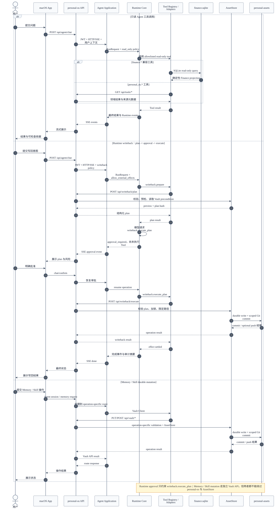

# personal-system 架构图

> 状态：当前实现的可视化伴随文档
>
> 基线日期：2026-08-31
>
> 范围：`personal-system`、`personal-assets`、`personal-os`、`personal-agent`、`personal-tools`

本文用多个较小视角呈现当前系统，而不是把产品边界、进程拓扑和代码组件挤在一张图里。
规范性描述仍以 [personal-system 最新设计](personal-system-design.md) 为准；
`personal-os` 的当前范围仍以
[migration-boundary.md](../personal-os/docs/migration-boundary.md) 为准。

## 1. 系统全景

这张图回答“各仓库分别拥有什么，以及用户从哪里进入系统”。



[Mermaid 源文件](diagrams/personal-system-context.mmd)

核心含义：

- `personal-assets` 持有长期事实和个人资产，不依赖 App 或 Agent 才能存在。
- `personal-os` 持有产品体验、业务领域、用户上下文和受控写回。
- `personal-agent` 持有通用 Agent Application 和可恢复 Runtime，不持有业务真相。
- `personal-tools` 当前提供 `weixin-clip` 和 `workspace-git-delivery`；
  前者写入用户授权的原始资料目录，后者只以全局符号链接安装给 Codex。
  两者都不参与 API/Agent 运行时调用，也不定义产品事实源。
- `personal-system` 顶层仓只负责治理、项目登记和跨仓边界。

## 2. 当前运行拓扑

这张图回答“本机运行了哪些进程、运行态放在哪里，以及它们怎样通信”。



[Mermaid 源文件](diagrams/personal-system-runtime.mmd)

当前 API 和 Agent 由 `launchd` supervisor 管理。macOS App 可以退出，但 Go API、
Python Agent 和 ReviewService 可以继续运行。`personal-os var/` 与 `personal-agent var/`
中的 SQLite、索引、trace、cache 和 lock 均为可重建或可丢弃运行态，不能取代
`personal-assets`。`finance.sqlite` 由 `personal-os` 构建，同时保留给
`personal-agent finance.*` 工具只读查询的兼容路径。

## 3. personal-agent 组件

这张图回答“Agent Application、LangGraph 和独立 Runtime Core 如何分工”。



[Mermaid 源文件](diagrams/personal-agent-components.mmd)

最重要的边界是：

- FastAPI、Commander、Domain Agent、LangGraph 属于 Application / Orchestration。
- Runtime Core 只理解 operation、event、approval、effect 和通用 ports。
- Runtime Core 不理解 `personal-os`、Finance、Research、用户或 Vault。
- Runtime operation event、approval 和 effect 通过 `SQLiteRuntimeStore` 持久化；
  Runtime debug trace 是随 `RunHandle` 丢弃的诊断视图。
- `TraceLogger` / OTel 属于 Application Infrastructure，不是 Runtime Port。
- `finance.*` 保留共享 `finance.sqlite` 只读兼容路径；`personal_os.*`、
  `writeback.*` 通过远程 Tool Provider 使用 `personal-os`。
- Skills、RAG 文档和启动时 Memory projection 从 Vault 只读加载；
  Memory / Skill mutation 则经独立 `Vault Client -> /api/vault/* -> AssetStore` 链路。

## 4. personal-os 组件

这张图回答“macOS 产品、Go API、领域包、后台任务和存储边界怎样组合”。



[Mermaid 源文件](diagrams/personal-os-components.mmd)

`personal-os` 的领域能力集中在 API 和 Go packages 中。SwiftUI 客户端负责导航、
输入和展示，不复制收益计算、持仓计算或写入规则。Finance 写入由
`finance-writes` 调用 AssetStore；Research、收益历史固定、Vault 和 Runtime writeback
由 `apps/api` 的 operation-specific handlers 编排 AssetStore。纯领域 package 不绕过
API 自行持久化 Vault。

## 5. Agent 读取与 durable mutation

这张图回答“只读工具、Runtime writeback 和 Memory / Skill mutation 有什么区别”。



[Mermaid 源文件](diagrams/personal-system-writeback.mmd)

- 只读路径可以读取共享 Finance projection，或调用 `personal_os.*` Tool Provider。
- Runtime writeback 采用 `plan -> approval -> execute`；当前 Runtime 只在
  `writeback.execute_plan` 真正执行前挂起，不会在审批前调用副作用工具。
- Memory / Skill mutation 不属于 Runtime writeback。它由 Agent 的 Vault Client 调用
  `personal-os /api/vault/*`，经过 operation-specific validation 和 AssetStore。
- 两类 durable mutation 都不允许 Agent 直接修改 Vault；Tool Provider 也不能通过
  重新启动同一个 operation 绕过 Runtime effect journal。

## 6. 图例与维护

- 实线表示当前运行时调用、数据传输或明确写入。
- 虚线表示治理约束、只读投影、启动管理或可选接入。
- 绿色表示 durable asset，蓝色表示 `personal-os`，黄色表示 `personal-agent`。
- 灰色表示治理、运行态或外部基础能力。
- 图中 `personal-os` 组件图使用 Mermaid ELK layout，其余图使用默认 flowchart /
  sequence layout。

修改 `.mmd` 后，在工作区根目录重新生成 SVG：

```bash
for file in docs/diagrams/*.mmd; do
  mmdc -i "$file" -o "${file%.mmd}.svg" -b transparent
done
```
