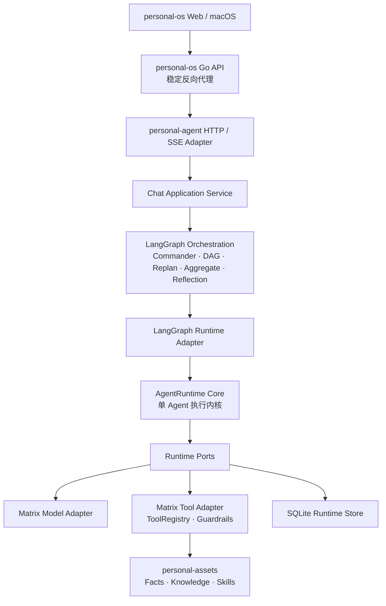
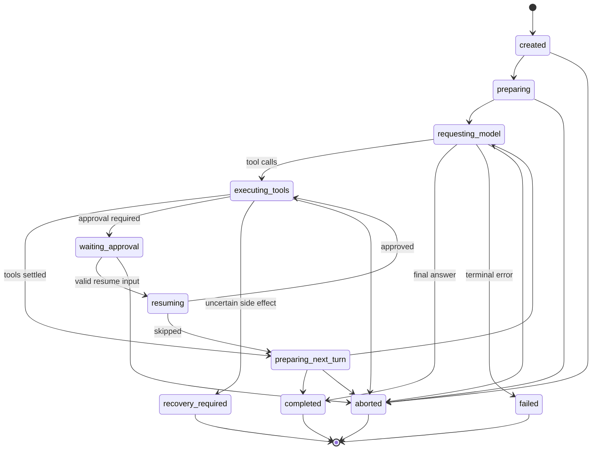

# Personal Agent 独立 Runtime 详细设计

> 状态：已完成设计并落地；2026-08-16 已完成真实观察并清理顶层 legacy 执行路径
>
> 日期：2026-08-13
>
> 适用范围：`personal-system`、独立 `personal-agent`、`personal-os`、`personal-assets`

## 1. 背景

当前个人助理能力分布在 `personal-system` 的多个独立项目中：

- `personal-agent`：完整的 Matrix Agent 平台，包含 Commander、Domain Agent、LangGraph DAG、ReAct、RAG、Memory、Skills、Guardrails、HITL、评测和 Web 服务。
- `personal-os`：个人系统产品入口，包含 Web/macOS 客户端、Go API、finance 能力和一个较早期的只读 `apps/agent`。
- `personal-assets`：长期事实、知识、Skills 和个人资产的 durable source of truth。
- `personal-tools`：MCP、脚本和自动化工具。

现有顶层治理文档曾将独立 `personal-agent` 视为迁移来源，计划由 `personal-os/apps/agent` 替代。实际代码状态已经发生变化：独立 `personal-agent` 仍在持续演进，能力显著超过 `personal-os/apps/agent`。本次评审确认新的长期边界：

> 独立 `personal-agent` 是长期 Agent 平台和权威 Agent Runtime 所在项目；`personal-os/apps/agent` 进入渐进退役路径；`personal-os` 通过 HTTP/SSE 使用独立 Agent 服务。

本设计借鉴 Pi 的内核思想，但不把 personal-agent 改造成 Pi。保留 personal-agent 已经形成优势的领域产品能力，将可复用的单 Agent 执行机制从 LangGraph 和 `ChatService` 中抽离为独立 Runtime。

## 2. 当前问题

当前 `ChatService` 和 LangGraph 节点共同承担了过多职责：

- Provider 和模型选择；
- 对话历史加载；
- Commander 分类和规划；
- 单 Agent ReAct 循环；
- 工具调用和 Guardrails；
- DAG 并行委派；
- HITL 中断和恢复；
- SSE 事件组装；
- LangGraph checkpoint 管理；
- 最终消息保存和 Memory Evolution。

迁移前单 Agent 主链表现为：

```text
react_prepare
  → react_llm
  → react_tool
  → react_evaluate
  → react_llm ...
```

这套实现可以工作，但产生了以下结构性问题：

1. 单 Agent 执行机制与 LangGraph 业务编排耦合，难以独立测试和复用。
2. `ChatService` 同时是应用服务、运行时协调器和协议适配器，变更影响面过大。
3. 事件由多处以字符串和 dict 直接发出，缺少统一顺序和持久化边界。
4. LangGraph checkpoint、会话历史和工具副作用分别管理，无法准确回答一次执行“现在进行到哪里”。
5. HITL 可以暂停和恢复当前图，但尚未形成独立、可审计、可重复消费保护的 operation 状态。
6. Codex direct、deep research 和标准 ReAct 形成多条执行路径，生命周期和事件语义不统一。

## 3. 设计目标

### 3.1 核心目标

1. 建立不依赖 LangGraph、FastAPI、SSE 和具体 Domain Agent 的单 Agent Runtime。
2. 让 LangGraph 收敛为多 Agent 业务工作流编排器。
3. 为模型调用、工具执行、审批、重试、取消和恢复建立统一状态机。
4. 为 Runtime 定义稳定、可持久化、可映射到现有 SSE 的事件模型。
5. 保留现有 Commander、Domain Agent、DAG、RAG、Memory、Skills、Guardrails 和 Personal OS 工具。
6. 保持 `personal-os` 当前 `/api/agent/*` 和核心 SSE 行为兼容。
7. 支持同一 App 不同时间由不同用户登录，确保 Session、Memory、Operation 和审批归属隔离。
8. 建立自动化架构护栏，长期防止下层反向依赖上层。

### 3.2 非目标

- 不复制 Pi 的 TUI、Package Gallery 或 Provider 数量。
- 不用 Runtime 替换 Commander、DAG、replan、aggregate 和 reflection。
- 不建设高并发多租户平台。
- 不支持多个 personal-agent 进程共享一个运行态数据库。
- 不引入 Postgres、分布式锁、消息队列或跨机器 operation 恢复。
- 不在本次改造中清理现有 JWT、`user_id` 字段或用户表。
- 不让 Runtime 直接写 `personal-assets` 文件或绕过受控工具/API。
- 不删除旧 `messages` 表、分支读取兼容或 `personal-os/apps/agent`（它们属于独立迁移边界）。
- Agent-as-Tool 内部仍保留嵌套 ReAct helper，直到该能力迁移到 Runtime；它不是顶层业务执行路径。
- 不在第一阶段统一 Codex CLI 自带 Agent 循环。

## 4. 已确认的关键决策

### 4.1 采用 Python 内部独立 Runtime

评估过三种路径：

1. 直接引入 Pi Agent Core：复用快，但 TypeScript/Python 跨语言和现有领域能力接入成本高。
2. 用 Runtime 完全替换 LangGraph：内核统一，但会损失已经成熟的领域编排能力。
3. 在 Python 内实现独立 Runtime，由 LangGraph 通过 Adapter 调用。

采用第三种。它能保留领域能力，同时获得清晰的单 Agent 执行边界。

### 4.2 使用 SQLite 作为权威运行态存储

SQLite 用于：

- 会话树；
- Runtime operation 当前状态；
- 审批；
- 工具副作用状态；
- Runtime events；
- LangGraph checkpoint。

原因是这些对象需要索引查询、可变状态和跨表原子提交。JSONL 保留为导出、诊断和会话交换格式，不作为权威运行态。

### 4.3 单实例、顺序登录、多用户数据隔离

产品不追求多人同时在线，但允许不同用户在不同时段登录：

- HTTP/Application 层继续负责认证和会话归属检查。
- Runtime Core 不理解 JWT、密码或角色。
- Runtime 使用不可解释的 `owner_id` 作为持久化隔离键。
- 用户只能查看、恢复和审批自己的 operation。
- 同一 session 同时只允许一个活动 operation。
- 同一用户的不同 session 可以并行。
- LangGraph DAG 的不同 Domain Agent operation 可以并行。

### 4.4 Runtime 固定主路径

Runtime 已完成真实观察并成为唯一顶层执行路径。`MATRIX_RUNTIME_MODE` 不再参与路由；健康接口保留 `runtime_mode="runtime"` 作为兼容字段。发布回退通过 Git/deployment 版本回退并重启，不通过运行时 legacy 开关。

正常单 Agent 和 Deep Research 的图片附件均以 provider-neutral content blocks 传递，并由应用层适配为 `image_url` data URL。旧 `messages`/分支数据仍保留读取兼容，Agent-as-Tool 的嵌套 ReAct helper 仍保留，不能误认为顶层 legacy。

## 5. 目标架构



### 5.1 分层职责

#### personal-os 客户端

- 提供产品交互。
- 继续调用 `/api/agent/*`。
- 不理解 Runtime operation 内部状态。

#### personal-os Go API

- 保持稳定反向代理边界。
- 添加 personal-agent 服务 JWT。
- 透传 HTTP 状态、SSE 流和客户端取消。
- 不保存 Agent 会话和 Runtime 状态。

#### personal-agent HTTP/SSE Adapter

- 验证认证和请求格式。
- 将 Runtime/Orchestration Event 映射为现有 SSE。
- 不实现模型或工具循环。

#### Chat Application Service

- 装配 owner、session、附件、Provider 和用户上下文。
- 调用 LangGraph Orchestration。
- 触发最终消息、Memory Evolution 等应用级后处理。
- 不实现单 Agent ReAct 循环。

#### LangGraph Orchestration

- Commander 分类、规划和 Agent 路由。
- 多 Agent DAG、依赖、并行委派和 replan。
- aggregate 和 reflection。
- 保存业务工作流 checkpoint。
- 通过 Adapter 调用 Runtime，不执行模型/工具循环。

#### AgentRuntime

- 单 Agent 模型调用和 ReAct 循环。
- 工具生命周期、参数验证结果消费和工具结果回填。
- 重试、取消、审批挂起和恢复。
- Runtime event 顺序和 operation 状态。
- 不知道 LangGraph、Commander、FastAPI、SSE 和具体 AgentDefinition。

## 6. 严格单向依赖

### 6.1 代码依赖方向

```text
server/http-sse
    → application/chat
    → orchestration adapters
    → runtime.adapters
    → runtime.core
    → runtime.ports
    → runtime.domain
```

箭头表示代码依赖方向：左侧/上层可以依赖右侧/下层；任何下层不得反向 import 上层。`runtime.domain` 不依赖其他业务模块；`runtime.ports` 只依赖 domain 类型。

### 6.2 Runtime Core 禁止依赖

`matrix.runtime.domain`、`matrix.runtime.ports` 和 `matrix.runtime.core` 禁止导入：

- `matrix.chat`
- `matrix.server`
- `matrix.orchestration`
- `matrix.agent`
- `langgraph`
- `fastapi`
- personal-os 中的任何模块

Runtime 不主动查找 `AgentDefinition`。上层负责把它解析为最终的 system prompt、model、tools 和 execution options。

### 6.3 依赖倒置

Runtime 通过自己定义的 Port 调用外部能力：

```python
class ModelPort(Protocol):
    def stream(self, request: ModelRequest) -> Iterator[ModelEvent]: ...

class ToolExecutorPort(Protocol):
    def execute(self, request: ToolRequest) -> ToolResult: ...

class OperationStorePort(Protocol):
    def load(self, owner_id: str, operation_id: str) -> OperationState | None: ...
    def commit(self, transition: StateTransition) -> None: ...
```

外层提供实现：

- `MatrixModelAdapter`
- `MatrixToolAdapter`
- `SQLiteRuntimeStore`
- `LangGraphRuntimeAdapter`
- `SSEEventAdapter`

Port 回调只能完成声明职责，不能让 Runtime 通过回调操纵 LangGraph 路由。

### 6.4 架构测试

新增自动化测试扫描 Python AST，违反禁止依赖即失败。架构测试属于必跑质量门禁，不能依赖人工 review 维持边界。

## 7. 建议模块布局

```text
src/matrix/runtime/
  __init__.py
  domain/
    requests.py
    results.py
    events.py
    messages.py
    operations.py
    approvals.py
    tools.py
    errors.py
  ports/
    model.py
    tools.py
    store.py
    clock.py
    ids.py
  core/
    runtime.py
    loop.py
    reducer.py
    recovery.py
    retry.py
  adapters/
    model.py
    tools.py
    sqlite_store.py
    legacy_session.py
  testing/
    fake_model.py
    fake_tools.py
    memory_store.py

src/matrix/orchestration/runtime_adapter.py
src/matrix/server/runtime_sse.py
```

`runtime.adapters` 可以依赖现有 `matrix.llm`、`matrix.tools` 和存储实现，但 Runtime Core 只能依赖 Port。

## 8. Runtime 公共接口

### 8.1 启动和恢复

```python
handle = runtime.start(request)

handle.operation_id
handle.events()       # Iterator[RuntimeEvent]
handle.result()       # RunResult
handle.cancel(reason="")
```

恢复入口：

```python
handle = runtime.resume(
    owner_id=owner_id,
    operation_id=operation_id,
    resume_input=ResumeInput(
        kind="approval",
        decision="approve",
    ),
)
```

第一阶段使用同步 Iterator，以兼容当前 LLM Client、FastAPI streaming 和 LangGraph。接口模型不绑定线程实现，后续可增加 async facade。

### 8.2 RunRequest

```text
owner_id
session_id
orchestration_run_id（可选）
agent_id（仅用于标识和审计）
messages
system_prompt
model
tools
tool_context
execution_options
metadata
```

`owner_id` 是隔离键，不是 Runtime 内的权限对象。`tool_context` 是不透明应用上下文，具体含义由 Tool Adapter 解释。

### 8.3 ExecutionOptions

第一阶段至少包含：

```text
max_turns
max_tool_calls
model_retry_policy
context_window_policy
tool_execution_mode
timeout
thinking_level
```

为保持现有行为，第一阶段工具执行默认 `sequential`。只有明确声明可并行且没有副作用冲突的工具，后续才允许 `parallel`。

### 8.4 RunResult

```text
outcome: completed | suspended | failed | aborted | recovery_required
operation_id
final_message
tool_results
usage
error
suspension
```

`suspended` 表示可通过明确输入恢复；`recovery_required` 表示系统无法证明自动恢复安全，需要人工处理。

## 9. Runtime 事件模型

### 9.1 统一信封

每个事件包含：

```text
event_id
owner_id
operation_id
session_id
sequence
timestamp
type
payload
```

`sequence` 在一个 operation 内严格递增。`event_id` 全局唯一，用于诊断和未来 SSE 重连。

### 9.2 Runtime Event 类型

- `run_start`
- `run_end`
- `turn_start`
- `turn_end`
- `message_start`
- `message_delta`
- `message_end`
- `tool_start`
- `tool_update`
- `tool_end`
- `approval_required`
- `retry_scheduled`
- `retry_start`
- `retry_end`
- `run_suspended`
- `run_resumed`
- `run_failed`
- `run_aborted`
- `recovery_required`

### 9.3 Orchestration Event 类型

以下仍属于上层，不进入 Runtime：

- `plan_created`
- `step_start`
- `step_done`
- `step_error`
- `replan`
- `agent_result`
- aggregate/reflection 进度

### 9.4 事件顺序

概念顺序：

```text
Runtime transition
  → SQLite 原子提交状态、事件和会话条目
  → Trace/OTel 订阅
  → LangGraph 调用方
  → HTTP/SSE 兼容适配器
```

用户看到的权威事件必须已经持久化。纯 `message_delta` 可以批量提交，以避免逐 token SQLite 写入；批次内仍保持 sequence 顺序。发生崩溃时不承诺恢复尚未提交的 token delta。

## 10. Runtime 状态机



Operation state 保存完整快照，不依赖重放旧 event 推导当前 phase。Event 用于审计、诊断和外部消费，不是恢复的唯一来源。

## 11. 三层持久化模型

### 11.1 Session Tree

回答“发生过什么”，长期保存：

- user message；
- assistant message；
- tool call；
- tool result；
- compaction；
- branch summary；
- plan；
- custom entry。

条目不可变，通过 `parent_id` 构成会话树。`sessions.leaf_id` 表示当前分支位置。

### 11.2 Runtime Operation

回答“一个 Agent 现在执行到哪里”，保存：

- phase；
- 当前 turn；
- 模型请求 intent；
- 待执行/已执行工具；
- 审批；
- retry；
- pending result；
- 恢复策略和错误。

### 11.3 LangGraph Checkpoint

回答“整个业务工作流进行到哪里”，保存：

- Commander plan；
- 已完成步骤；
- 待执行领域 Agent；
- replan；
- aggregate/reflection 状态；
- Runtime operation 引用。

三层不能互相替代。Runtime 不读取 LangGraph 内部 checkpoint；LangGraph 只保存 operation ID 和 operation 结果。

## 12. SQLite 数据模型

### 12.1 核心表

```text
sessions
session_entries
orchestration_runs
runtime_operations
runtime_events
runtime_approvals
runtime_tool_effects
```

现有 `messages`、`user_profile` 和 LangGraph checkpoint 表在迁移期保留。

### 12.2 runtime_operations

```text
operation_id
owner_id
session_id
orchestration_run_id
agent_id
phase
turn_index
state_json
version
created_at
updated_at
```

`state_json` 是带 schema version 的完整状态。`version` 用于 compare-and-set，防止审批和恢复被重复消费。

### 12.3 runtime_events

```text
event_id
owner_id
operation_id
session_id
sequence
event_type
payload_json
created_at
```

唯一约束：`(operation_id, sequence)`。

### 12.4 runtime_approvals

```text
approval_id
owner_id
operation_id
tool_call_id
tool_name
arguments_json
risk
status
decision
expires_at
created_at
resolved_at
version
```

`status` 至少包含 `pending/approved/skipped/expired/cancelled`。

### 12.5 runtime_tool_effects

```text
effect_id
owner_id
operation_id
tool_call_id
tool_name
recovery_policy
idempotency_key
status
request_json
result_json
created_at
updated_at
```

`status` 至少包含 `intent/executing/settled/failed/uncertain`。

### 12.6 原子提交

一次 Runtime transition 在同一 SQLite 事务中提交：

```text
更新 operation 完整状态
+ 插入 Runtime events
+ 插入 Session entries
+ 更新 session leaf
+ 更新 approval/tool effect
```

事务中不调用模型、工具、网络或用户回调。

## 13. 外部副作用与恢复

### 13.1 Effect Sandwich

```text
事务 1：提交“即将执行 X”及稳定 ID
  ↓
执行模型请求或工具调用
  ↓
事务 2：提交结果、事件、会话条目和下一状态
```

SQLite 无法和外部 API 构成分布式事务。因此恢复策略必须显式承认“外部执行完成但 settlement 未提交”的不确定窗口。

### 13.2 工具恢复策略

每个工具声明：

```text
replayable   # 只读，可安全重放
idempotent   # 写操作，必须提供 idempotency key
manual       # 非幂等副作用，不能自动重放
```

第一阶段：

- 只读工具允许安全恢复；
- idempotent 工具只有在现有受控接口真实支持 idempotency key 后才启用自动恢复；
- 其他高风险写工具统一按 `manual`；
- 未声明策略的工具默认 `manual`，不能默认当作只读。

### 13.3 模型请求恢复

- 临时网络错误、限流和服务错误按 retry policy 重试。
- 认证失败、模型不存在和配置错误直接失败。
- 上下文超限触发一次 compaction，再重试一次。
- 崩溃发生在模型请求中时，可使用稳定 request ID 重新请求，但不保证 Provider 级去重。
- 部分 assistant 输出保存为 incomplete，不作为最终回答。

### 13.4 工具失败

可预期的工具错误转为 `tool_result(is_error=True)` 返回模型，让 Agent 自我修正。Runtime invariant 损坏、Store 失败和无法分类的副作用不确定性才终止 operation。

## 14. HITL 设计

审批请求包含：

```text
approval_id
owner_id
operation_id
tool_call_id
tool_name
sanitized_arguments
risk
expires_at
```

进入 `waiting_approval` 后：

- 不持有线程；
- 不持有数据库事务；
- operation 可跨进程重启恢复；
- 当前用户退出不会删除审批；
- 其他用户登录后看不到也不能消费该审批。

恢复校验：

1. 当前 owner 与 operation owner 一致；
2. operation 仍处于 `waiting_approval`；
3. approval 仍是 `pending`；
4. approval 未过期；
5. operation version 与预期一致。

相同审批只能消费一次。approve 后继续工具执行，skip 后生成明确的 error/skip tool result，再进入下一 turn。

## 15. 进程启动恢复

启动时扫描未完成 operation：

- `waiting_approval`：恢复为可审批状态；
- `requesting_model`：标记为可重试；
- replayable tool intent：允许恢复执行；
- idempotent tool intent：携带原 idempotency key 恢复；
- manual tool intent：进入 `recovery_required`；
- 状态 schema 不兼容或 invariant 损坏：标记 failed 并保留诊断。

第一阶段不自动恢复所有 operation 到后台运行。服务先将它们归类为 `resumable/recovery_required/failed`，由拥有者重新进入会话或显式恢复，避免启动时产生意外副作用。

## 16. LangGraph 集成

### 16.1 迁移前

```text
commander_plan
  → react_prepare
  → react_llm
  → react_tool
  → react_evaluate
  → aggregate
```

### 16.2 迁移后

```text
commander_plan
  → run_agent_node
       └─ AgentRuntime.start(...)
  → aggregate
  → reflection
```

### 16.3 多 Agent DAG

```text
commander_plan
  → Send("runtime_delegate") × N
       ├─ AgentRuntime.run(investment-analyst)
       ├─ AgentRuntime.run(knowledge-manager)
       └─ AgentRuntime.run(coding-assistant)
  → replan
  → aggregate
  → reflection
```

每个 DAG step 有独立 operation ID，共享 orchestration run ID。LangGraph 保存 step 与 operation 的映射。

### 16.4 Compaction 边界

Runtime 决定何时需要压缩，具体压缩算法通过 Context/Compaction Adapter 使用现有 `matrix.context` 能力。Runtime Core 不反向依赖现有 Context 模块。第一阶段复用现有压缩语义，不同时重写算法。

### 16.5 Codex direct

Codex CLI 已经拥有自己的 Agent 和工具循环。第一阶段不能把它再包进新的 ReAct 循环，否则会形成双重 Agent。

处理方式：

- Codex direct 通过 Runtime application adapter 接入；adapter 只把外部进程的 started/message/tool/progress/completed/failed/cancelled 生命周期映射为 Runtime operation/event。
- Codex CLI 继续拥有自己的 Agent/tool loop，Runtime 不再次规划或执行 Codex 的工具调用，避免双重 Agent。
- Codex direct 不再保留顶层 legacy direct 路径；回退通过代码版本回退完成。

### 16.6 Deep Research

当前 deep research 含固定工具预取和 Codex 汇总。它属于应用工作流，不属于通用 Runtime。现已通过 `DeepResearchWorkflow` 接入 Runtime Store：每个证据工具调用、失败重试和 synthesis 都产生有序 Runtime event；workflow 本身仍位于 application adapter 层，不下沉到通用 Runtime Core。图片附件已纳入同一 Runtime 工作流。

## 17. HTTP/SSE 兼容

`personal-os` 继续暴露：

- `GET /api/agent/health`
- `GET /api/agent/tools`
- `POST /api/agent/tools/call`
- `POST /api/agent/chat`
- `POST /api/agent/reset`

核心 SSE 保持：

```text
token
thinking
tool_call
tool_result
progress
error
done
```

映射示例：

```text
message_delta        → token
tool_start           → tool_call
tool_end             → tool_result
approval_required    → confirm_request
run_failed           → error
run_end              → done
```

Orchestration Event 继续映射到 `classify/progress/agent_result` 等现有事件。

未来可以通过 SSE `id:` 和 `Last-Event-ID` 支持断线续传，但第一阶段不强制升级 personal-os 客户端。

## 18. personal-system 跨仓边界

### 18.1 personal-agent

主体改造：

- 独立 Runtime；
- Runtime Store；
- LangGraph Adapter；
- SSE Adapter；
- Runtime 固定主路径；发布回退通过版本回退；
- 测试和评测。

### 18.2 personal-os

接入调整：

- Go API 继续作为客户端与 Agent 之间的稳定代理；
- `PERSONAL_OS_AGENT_URL` 指向独立 personal-agent；
- `tools/dev` 支持 managed/external 两种 Agent 模式；
- health、smoke、E2E 改为验证独立服务；
- 第一阶段不要求 Web/macOS UI 理解新 Runtime 事件。

### 18.3 personal-os/apps/agent

退役两步走：

1. 停止默认启动，源码保留作为短期回退。
2. 独立 Agent 接入稳定并通过 smoke/E2E 后，另行删除。

### 18.4 personal-assets

- 继续作为 Facts、Knowledge、Skills 的 durable source of truth。
- Runtime operation、checkpoint、event、SQLite 和日志不得写入该仓库。
- Agent 的长期写入继续通过受控 API/AssetStore/Skill 流程。
- 本次只做契约验证，不迁移数据模型。

### 18.5 personal-tools

不修改。MCP/工具通过现有 Adapter 接入，验证协议兼容即可。

### 18.6 personal-system 顶层治理

实施阶段需要修订：

- `workspace.yaml`
- `docs/project-progress.md`
- `docs/archive/reference/personal-os-architecture.md`
- `personal-os/docs/migration-boundary.md`

修正“独立 personal-agent 已归档”的历史判断，记录新的长期边界。

## 19. 开发与启动拓扑

推荐两种模式：

### managed

```text
personal-os/tools/dev
  ├─ personal-os API
  ├─ 相邻仓库 personal-agent
  └─ personal-os Web
```

### external

```text
PERSONAL_OS_AGENT_URL=http://127.0.0.1:7101 personal-os/tools/dev
```

external 模式不管理 personal-agent 生命周期，适合独立调试和未来可信节点部署。

## 20. 迁移工作包

### WP1：Runtime 骨架与架构护栏

- 新增 domain、ports、core、adapters、testing 布局。
- 定义请求、结果、事件、状态、错误和 Port。
- 实现 Memory Store、Fake Model、Fake Tool。
- 增加禁止反向依赖的架构测试。
- 不接生产链路。

验收：Runtime Core 可以独立 import 和测试，不依赖 LangGraph/FastAPI。

### WP2：内存版单 Agent Runtime

- 实现模型流和 ReAct 工具循环。
- 实现顺序工具执行、重试、取消和事件。
- 复用现有 ToolRegistry/Guardrails Adapter。
- 复用现有 Context/Compaction Adapter。
- 用现有 ReAct 测试和 golden cases 验证行为。

验收：Fake Model 下完整覆盖单 Agent 主链，不改变线上流量。

### WP3：LangGraph 单 Agent 接入（已完成）

- 新增 `run_agent_node`。
- Runtime 成为唯一顶层执行路径，健康字段仍固定返回 `runtime`。
- 标准 function-calling 路径可以切换到 Runtime。
- Codex direct、deep research 通过 application adapter 接入 Runtime；多 Agent DAG 继续由 LangGraph + Runtime step 路径负责。

验收：普通 Codex、Deep Research 文本/图片、DeepSeek、SQLite 持久化和重启恢复已通过真实验收。

### WP4：SQLite 持久化与 HITL

- 新增 Runtime Store schema 和 migration。
- 实现 operation/event/approval/effect 原子 transition。
- 实现启动扫描和恢复分类。
- 将 Runtime HITL 映射到现有 confirm API。
- session entry 双写验证。

验收：等待审批可跨服务重启恢复；重复审批被拒绝；owner 隔离有效。

### WP5：多 Agent DAG 接入

- `runtime_delegate_node` 为每个 step 构造 RunRequest。
- 保留 Send、step dependency、replan、aggregate 和 reflection。
- 统一 Domain Agent 执行路径。
- 保持每 step 独立 operation。

验收：多 Agent DAG、并行 fan-out/fan-in 和 replan 回归通过。

### WP6：personal-system 收口

- personal-os 默认连接独立 personal-agent。
- `tools/dev` 支持 managed/external。
- 更新 smoke/E2E 和治理文档。
- 停止默认启动 `personal-os/apps/agent`。
- 稳定观察后单独删除旧 Agent。

验收：personal-os 产品入口无感切换到独立 Agent，旧 Agent 不再承担默认运行职责。

### 后续清理边界

- 已删除顶层 legacy Codex/Deep Research 方法、顶层 legacy LangGraph 路由和运行时切换开关。
- 保留旧 messages/分支读取兼容、Runtime-first 双写和 `personal-os/apps/agent` 迁移边界。
- 保留 Agent-as-Tool 所需的嵌套 ReAct helper；后续若迁移该能力，再单独删除。
- JSONL import/export、SSE 断线续传仍是独立后续工作。

## 21. 测试策略

### 21.1 Runtime Core 单元测试

- 无工具流式回答；
- 单轮和多轮 ReAct；
- 多个工具调用；
- 参数错误和工具失败；
- 模型重试和上下文超限；
- 取消和超时；
- HITL 挂起与恢复；
- 重复审批；
- manual effect 的 recovery_required；
- event sequence 连续性；
- max turns/max tool calls 防无限循环。

### 21.2 Store 契约测试

同一套 contract tests 运行在 Memory Store 和 SQLite Store：

- transition 原子性；
- operation 完整快照；
- event 顺序；
- session entry 和 leaf 更新；
- owner 隔离；
- 单 session 单活动 operation；
- compare-and-set；
- schema migration；
- 崩溃点注入；
- 未结算 effect 扫描。

### 21.3 LangGraph 集成测试

- Commander 路由；
- 单 Agent Runtime node；
- 多 Agent DAG；
- step dependency；
- replan；
- aggregate；
- reflection；
- Domain Agent 工具白名单；
- checkpoint 与 operation ID 对应关系。

### 21.4 产品契约测试

- `/api/agent/*` 端点兼容；
- JWT owner 透传；
- SSE 事件类型和顺序；
- HITL confirm；
- 客户端取消；
- Agent 重启恢复；
- personal-os Go proxy 不缓冲 SSE；
- personal-os Agent smoke；
- macOS/Web 核心 Agent 入口回归。

### 21.5 评测

- 现有 golden/smoke dataset；
- deterministic evaluator；
- 领域工具选择；
- 事实引用和反幻觉检查；
- 回答质量 baseline；
- legacy/runtime 差异报告。

## 22. 质量门禁

每个工作包必须满足：

1. Runtime 单元测试通过；
2. personal-agent 现有测试通过；
3. golden/smoke evaluation 不低于确认的 baseline；
4. personal-os Agent smoke 通过；
5. 没有新增架构反向依赖；
6. legacy/runtime 差异有明确解释；
7. 不对真实 `personal-assets` 产生测试写入；
8. 运行态只进入忽略的 `var/`、临时目录或测试 fixture。

## 23. 切换与回滚

- 每个 WP 独立提交。
- 当前顶层执行固定为 Runtime；发生问题时回退部署版本并重启。
- 不再通过 `MATRIX_RUNTIME_MODE` 切换；数据库 schema 继续只做向前兼容迁移。
- 新表只做向前兼容迁移。
- 旧 messages 表、分支读取兼容和旧 personal-os Agent 继续按各自迁移边界保留。
- Agent-as-Tool 嵌套 ReAct helper 暂保留；顶层 legacy 清理已完成。

## 24. 完成标准

本次内核改造完成需要同时满足：

1. 标准单 Agent 路径由独立 Runtime 执行。
2. LangGraph 只负责业务编排，不再实现模型/工具循环。
3. Runtime Core 无上层反向依赖，并有自动化约束。
4. Runtime operation 可以从等待审批和安全重放点恢复。
5. Session Tree、operation、event 和 tool effect 的原子边界明确并落地。
6. 多 Agent DAG 通过 Runtime 执行 Domain Agent，Commander/replan/aggregate/reflection 保持有效。
7. personal-os 通过稳定 Go API/SSE 使用独立 personal-agent。
8. personal-assets 的 durable source 边界不变，运行态不进入 Git。
9. 发布版本回退路径明确，且不依赖运行时 legacy 开关。
10. 现有领域评测和产品 smoke 不退化。

## 25. 后续文档与实施顺序

本设计确认后，下一步应在修改代码前生成按 WP 拆分的实施计划，至少明确：

- 每个 WP 修改的具体文件；
- 数据库 migration 顺序；
- 每一步测试命令；
- feature flag 默认值；
- cross-repo 提交顺序；
- personal-os 切换和回退操作；
- 各阶段不得提前删除的兼容代码。

实施计划确认后，再开始 `personal-agent` 代码变更。
