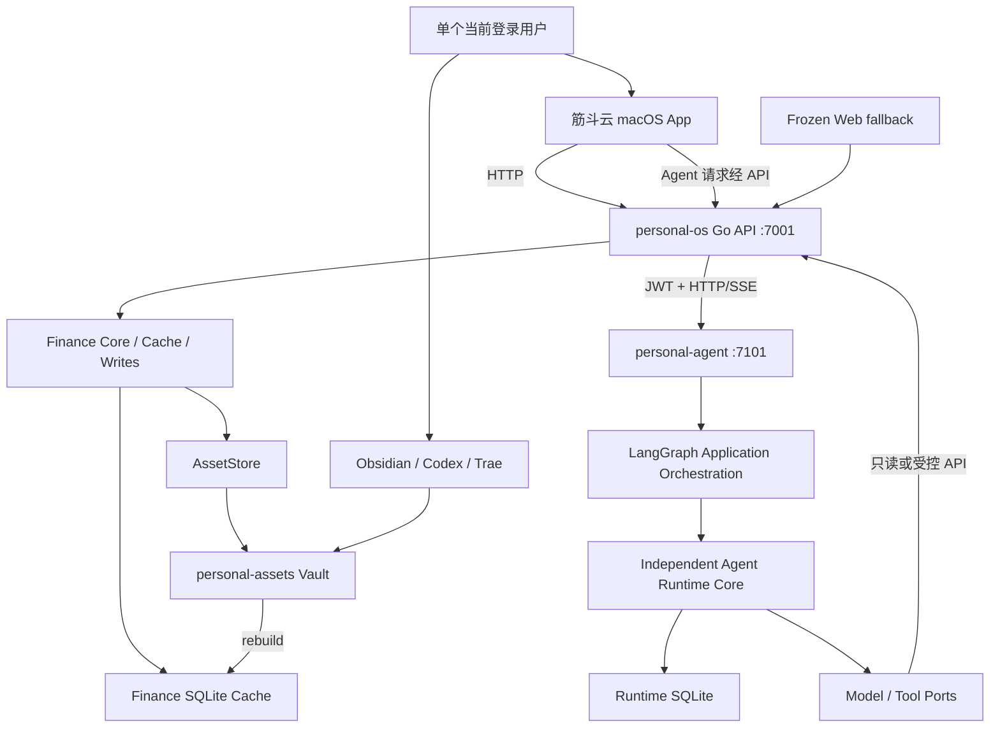

# personal-system 最新设计

> 文档状态：Canonical Architecture Baseline
>
> 基线日期：2026-08-21
>
> 适用范围：`personal-system`、`personal-assets`、`personal-os`、`personal-agent`、`personal-tools`
>
> 当前产品边界：`personal-os` V1 以投资快照、投研数据和个人助理工作台为主，长期设计不自动扩大当前实现范围。

## 1. 文档目的

本文是 `personal-system` 当前唯一的全局架构基线，用于统一产品定位、仓库职责、依赖方向、数据权威、Agent 执行边界和演进顺序。

本文同时描述四个层级，阅读时不得混淆：

- **架构宪法**：长期不应被具体技术实现破坏的原则。
- **当前已实现**：截至基线日期已经在代码和运行环境中成立的能力。
- **近期边界**：当前 V1 可以继续改进，但不能无计划扩大的范围。
- **长期目标**：需要后续详细设计和独立实施计划才能落地的能力。

当本文与更早的宽泛架构文档冲突时：

1. 全局方向以本文为准；
2. `personal-os` 当前实现范围以 `personal-os/docs/migration-boundary.md` 为准；
3. 具体数据协议以 `personal-assets-contract.md`、`assetstore-protocol.md` 和 Finance Fact Model 为准；
4. 子项目内部实现以各自仓库的现行代码和文档为准。

## 2. 产品定位

筋斗云是建立在个人长期资产库之上的 Personal Intelligence & Decision OS。

它的目标不是再造一个笔记工具，而是帮助用户：

1. 收集外部信息和记录个人输入；
2. 维护一个持续演化的个人世界模型；
3. 识别对自己真正有意义的新增与变化；
4. 把变化连接到已有知识、项目、判断和决策；
5. 在用户确认后，将长期价值沉淀回个人资产库。

简化表达：

> Knowledge 是底座，Changes 是引擎，Decision 是价值出口，Memory 是长期护城河。

投资研究与资产管理是第一个高价值 Vertical，不是整个系统的母体模型。

### 2.1 非目标

筋斗云不是：

- 第二个 Obsidian 或 Notion；
- 以 Chat 为中心的通用 AI 壳；
- 与 `personal-assets` 平行的权威知识库；
- 新闻聚合器或纯 RAG 搜索工具；
- Bloomberg、Koyfin 或 AlphaSense 的复制品；
- 由 AI 自动改写用户认知的黑盒；
- 面向团队协作或公共 SaaS 的多租户系统。

## 3. 架构宪法

以下原则优先于 UI、数据库、模型、语言和部署方式。

### 3.1 Vault owns truth

`personal-assets` 是长期个人资产的 Durable Source of Truth。

长期需要保留的事实、来源、知识、判断、项目记录、复盘、研究结果和决策历史，最终必须在 Vault 中有开放、可读、可迁移、可版本管理的表示。

SQLite、FTS、Vector DB、Graph、Embedding、cache、缩略图和 AI 派生关系都不是长期事实源。

### 3.2 App owns experience

`personal-os` 负责提供比直接浏览文件更好的日常体验，包括结构化输入、浏览、搜索、Today、投研、决策视图、Agent 交互、状态检查和受控写回。

App 可以有自己的运行态和投影，但不能成为第二个长期资产库。

### 3.3 AI proposes meaning

AI 可以分类、摘要、抽取、关联、比较、生成草稿和提出变化候选。

AI 默认不能静默：

- 把推断写成事实；
- 修改用户原文；
- 修改用户 Belief 或 Decision；
- 发明用户感受、动机和价值观；
- 超出 Skill 的读取和写入边界。

### 3.4 User owns judgment

最终判断、Belief、Decision、是否接受 AI 建议以及是否升级为 durable content，均由用户决定。

必须永久保持：

```text
Source ≠ Fact
Fact ≠ Belief
Belief ≠ Decision
AI inference ≠ User judgment
```

### 3.5 Folder is location; semantics are meaning

Vault 目录回答“内容放在哪里”；Semantic Projection 回答“内容是什么、和什么有关、影响什么”。

AI 可以建议语义关系，但不能以语义复杂为理由破坏、复制或接管用户已有目录体系。

## 4. 系统边界与仓库职责

### 4.1 `personal-system`

顶层仓库是 workspace / governance 边界，负责：

- 全局设计和规则；
- 项目登记与状态；
- 跨仓边界；
- 迁移记录；
- 少量治理和迁移工具。

它不拥有子项目源码，也不保存运行态。

### 4.2 `personal-assets`

长期资产仓和 Obsidian 主 Vault，负责：

- 来源材料与附件；
- durable facts；
- 结构化知识；
- 项目、复盘和个人判断；
- 财富事实与投研记录；
- Skills 和模板；
- Git 历史与长期审计。

Obsidian 目前仍是 broader knowledge 的主要人工编辑入口。

### 4.3 `personal-os`

产品和 API 边界，当前负责：

- macOS 筋斗云主客户端；
- Go API；
- finance cache 和确定性计算；
- snapshot create/correct/void 等窄结构化写入；
- 研究数据、研究卡、估值快照、观察池和基金池的受控 API 工作流；
- AssetStore 写入协议；
- Agent HTTP/SSE 代理；
- doctor、smoke 和本地运行管理；
- 冻结的 Web fallback。

`personal-os` 不导入 Agent Runtime Core，也不读取 Agent Runtime SQLite。

### 4.4 `personal-agent`

长期独立的 Python Agent Runtime 和 Agent 应用服务，负责：

- 模型与工具循环；
- LangGraph 编排；
- operation、event、effect 和 approval；
- HITL 暂停与恢复；
- 会话、记忆、Trace 和 Guardrails；
- Provider、Tool、MCP 和 Skill 适配；
- 面向 App 的 HTTP/SSE 契约。

它不拥有 finance facts、知识事实或用户最终判断。任何未来 durable 写入都必须经过 `personal-os` 的受控写回边界。

### 4.5 `personal-tools`

可复用工具、MCP Server、脚本和自动化仓，负责提供能力，不负责定义产品事实源或应用业务边界。

### 4.6 入口层

多个入口可以共存：

- macOS 筋斗云：日常产品主入口；
- Obsidian：Vault 的深度浏览与人工编辑入口；
- Codex / Trae：复杂维护、设计和深度操作入口；
- Web fallback：诊断、兼容和 E2E；
- Capture 工具：未来的外部信息入口。

所有入口必须共享同一 Durable Asset Layer 和受控写入协议。

## 5. 当前运行拓扑



当前本地部署是单 App、单 Agent 进程模型。系统同一时刻只面向一个登录用户，但允许不同时间由不同用户登录。会话和 Runtime operation 使用 `owner_id` 隔离；Vault 仍是该安装节点的个人资产边界，不按公共 SaaS 多租户设计。

## 6. 严格依赖方向

系统遵循单向依赖，下层不得反向依赖上层业务或 UI。

```text
Clients
  ↓
personal-os API / personal-agent HTTP API
  ↓
Application Services / LangGraph Adapters
  ↓
Domain Services / Runtime Ports
  ↓
Adapters: SQLite / Files / Git / Model / Tools
```

关键约束：

1. macOS App 不复制 finance 或 Agent 领域逻辑；
2. Web 和 App 只调用 API；
3. `personal-os` 通过 HTTP/SSE 使用 `personal-agent`，不导入其 Python 内核；
4. LangGraph 可以依赖 Runtime Adapter，Runtime Core 不理解 LangGraph、DAG 或 App；
5. Runtime Core 只依赖自己的 domain 和 ports；
6. SQLite、模型和工具实现位于 adapters，不能被 domain 反向引用；
7. `personal-agent` 不能绕过 API/AssetStore 直接写 durable Vault；
8. `personal-assets` 不依赖任何应用或 Runtime。

## 7. 数据权威与生命周期

### 7.1 Durable Truth

`personal-assets` 保存可跨进程、跨设备、跨模型长期存在的个人资产。

删除 App、Agent 或所有本地索引后，长期资产仍必须存在。

### 7.2 Rebuildable Projection

以下数据必须可从 Vault 或其他明确来源重建：

- finance SQLite cache；
- metadata index；
- FTS；
- Vector index；
- Semantic graph；
- Derived entity、topic、relation 和 change candidate；
- App 展示投影。

Projection 必须记录来源文件、版本和必要的 source span，不能成为隐形事实源。

### 7.3 Operational Runtime State

Agent Runtime SQLite 保存：

- session entries；
- orchestration runs；
- operations；
- events；
- approvals；
- tool effects。

它是运行中 Agent operation 的权威恢复状态，但不是个人知识或 finance facts 的事实源。

当前建设阶段，Runtime SQLite 中的 operation、event、approval 和 effect 视为可丢弃运行态。Runtime schema 变化允许重建 Runtime 自有表，不在代码中堆积历史运行态兼容逻辑；这不影响 `personal-assets`。

这类状态不能简单由 Vault 重建，因此需要事务、版本检查、effect journal 和恢复策略；operation 完成后，其中有长期价值的结果仍需通过 Writeback 写回 Vault。

#### 7.3.1 Durable Runtime Events 与 Ephemeral Debug Trace

Runtime 的恢复和审计信息可以进入 SQLite，但调试信息分为两层：

- **Durable Runtime Events**：operation 状态变化、审批、effect intent、工具调用及结果摘要等，服务于恢复、幂等和审计；
- **Ephemeral Debug Trace**：调试期间临时展示的详细模型上下文、上下文注入、Adapter 诊断和模型提供的推理摘要。

Ephemeral Debug Trace 默认只在当前运行期间通过 App、SSE 或开发者日志展示，不进入长期数据库，也不写入 Vault。调试结束后可以销毁或按短 TTL 过期。Trace 必须做凭据、Token、个人隐私和工具返回值的必要脱敏。

“原始隐式思维链”不是系统必须依赖的持久化对象；模型或 Provider 不提供时，Runtime 只展示结构化推理摘要、执行决策和工具轨迹。

### 7.4 Ephemeral State

日志、临时上传、模型缓存、构建产物、进程 PID 和前端临时状态不进入任何 Git 仓库。

## 8. 内容与语义模型

长期模型至少区分：

- `Source`：来源原本说了什么；
- `Fact`：经过确认、可长期复用的事实；
- `Observation`：用户或系统观察到的现象；
- `Claim`：来源或主体提出的主张；
- `Belief`：用户当前怎么看；
- `Question`：尚未解决的问题；
- `Decision`：用户在上下文中的选择；
- `Action`：决定后的行动；
- `Outcome`：行动结果；
- `WatchCondition`：触发重新判断的条件；
- `Relation`：上述对象之间的可追溯关系。

语义对象属于 Projection；只有对应的 Vault 表示才是 durable content。

### 8.1 Provenance

长期至少支持以下来源身份：

```text
USER_AUTHORED
USER_CONFIRMED
IMPORTED
EXTERNAL_SOURCE
AI_EXTRACTED
AI_INFERRED
AI_DRAFT
```

每个重要 Derived Object 需要回答：

- 来自哪个文件或外部来源；
- 对应哪个版本和位置；
- 谁生成；
- 是否经用户确认；
- 当前状态和置信度；
- 是否可安全重建。

## 9. 核心数据流

### 9.1 读取

```text
personal-assets
  → parser / cache builder / indexer
  → SQLite / FTS / Vector / Relation Projection
  → personal-os API 或 Agent Tool
  → App / Agent / Search
```

读取结果应携带 freshness、source revision 和 stale 状态。finance 数字由确定性工具计算，模型只负责解释。

### 9.2 当前 finance 写入

```text
App / Web
  → personal-os API
  → finance write validation
  → AssetStore
  → append fact / correction / void
  → Git commit
  → cache rebuild
  → API response
```

当前允许的 durable App 写入保持窄而结构化。发生 dirty worktree、重复日期、版本冲突或同步阻断时停止写入，不猜测合并。

### 9.3 未来 AI 写回

```text
Agent result
  → Skill output validation
  → Writeback proposal
  → path / risk / provenance policy
  → direct low-risk write or user confirmation
  → AssetStore / VaultService
  → durable representation
  → rebuild projections
```

在 WritebackService 和路径化权限落地前，Agent 默认保持只读，不得直接写 Vault。

### 9.4 Input 与 Progressive Structure

系统长期同时支持两条同等重要的输入路径：

- `Capture`：网页、PDF、文章、邮件、API、文件和自动 Monitor 等外部信息进入；
- `Create`：用户主动记录 Observation、Idea、Question、Belief、Decision、Review 和 Project Note。

外部来源默认先保存原文和元数据，进入 `资料/**` 或对应关注域的原始记录；AI 派生内容与来源分开。用户主动输入不能被当成自动收录的 fallback，因为大量最有价值的 Personal Intelligence 并不存在于互联网。

输入体验采用渐进式结构：

1. Level A：一句“记一下”，系统在后台建议目录、类型和关联；
2. Level B：普通 Markdown / Obsidian 笔记；
3. Level C：Decision、Project、Asset Fact、Thesis 等结构化对象 UI。

结构化对象 UI 最终仍然写 Vault，不能形成第二个权威数据库。

## 10. Intelligence Engine 目标边界

长期 Intelligence Engine 包含四类能力：

### 10.1 Understand

理解输入的类型、来源、实体、主题、事实候选、判断候选和潜在目录。

### 10.2 Connect

将新内容连接到已有 Entity、Topic、Belief、Project、Decision 和 WatchCondition。

### 10.3 Notice

生成面向个人世界模型的：

- New；
- Changed；
- Relevant；
- Needs Attention。

Changed 必须识别重复、加强、削弱、矛盾和实质变化，并主动抑制噪音。

### 10.4 Decide

维护通用决策链：

```text
Question → Options → Criteria → Evidence → Current View
         → Decision → Action → Outcome → Reflection
```

用户可以从一句自由文本开始，再根据价值逐步结构化。

### 10.5 Investment Vertical

投资场景在通用语义与决策模型上增加：

```text
Security / Position / Portfolio
Thesis / Assumption
Evidence / Counterevidence
Catalyst / Risk
WatchCondition / Decision / Outcome
```

Living Thesis 需要保留“原来相信什么、哪些证据加强或削弱、为什么改变、是否行动、结果如何”的版本演化。

产品原则是：

> Own the memory and reasoning layer. Rent the data and model layer.

系统不重造金融 Terminal；行情、财报和模型可以替换，长期拥有的是用户的 Thesis、Evidence、Decision、History 和 Context。

## 11. Agent、LangGraph 与 Runtime

### 11.1 分工

LangGraph 属于 Agent Application / Orchestration 层，负责：

- 任务分类；
- 规划和 DAG；
- Agent 路由；
- 上下游结果传播；
- 汇总、反思和重规划。

Independent Runtime Core 负责：

- operation 生命周期；
- model/tool loop；
- 状态转换；
- event；
- approval；
- effect journal；
- suspend/resume；
- 持久化恢复。

Runtime 不理解业务 DAG；Adapter 把 LangGraph step 映射为独立 `RunRequest`。

### 11.2 当前 Runtime 不变量

当前已经实现并验收：

- SQLite operation/event store；
- compare-and-set 状态版本；
- approval 原子消费；
- Effect Sandwich；
- HITL approve/skip/expiry；
- DAG 声明依赖结果注入；
- SSE 正常完成与客户端取消语义；
- owner 隔离；
   - Runtime 固定主路径；历史 legacy/shadow 仅保留在迁移记录中。

已完成普通对话、Deep Research 文本/图片、DeepSeek、SQLite 持久化和服务重启恢复验收。`MATRIX_RUNTIME_MODE` 已移除；发布回退通过 Git/deployment 版本回退并重启。

`AgentMode` 与 `Preset` 仍是面向用户的能力、权限和输出策略，不是执行引擎切换开关。

### 11.3 Skill 边界

Skill 是 executable contract，而不是 Prompt 收藏。长期 manifest 至少需要：

```text
Trigger
Input Contract
Reads
Writes
Processing Rules
Validation
Output Contract
Risk / Confirmation Policy
```

当前 Skills 已能被 Agent 加载和执行，但通用的路径化写入授权与 Writeback enforcement 仍是目标能力。

### 11.4 AgentMode 与 Preset

`AgentMode` 是同一个 Agent Runtime 上的能力、权限、上下文和输出策略组合，不是另一套 Agent 实现，也不改变 Runtime Core 的依赖方向。它至少可以约束：

- 可用的 Model、Tool、Skill 和 Adapter；
- 是否允许外部副作用及其确认策略；
- 上下文范围、预算、超时和重试策略；
- 输出结构和引用要求；
- 是否开启临时 Debug Trace。

`Preset` 是面向用户的命名配置，例如“投资研究”“快速记录”或“每日回顾”。它可以基于一个 `AgentMode` 调整模型、工具和输出参数，但不能绕过 Runtime、Vault 或 Writeback 的安全边界。

初始只定义两个稳定模式：

- `read_only`：默认模式，只允许检索、读取、分析和生成草稿，不允许直接写入 Vault；
- `writeback`：允许生成写入计划，但必须经过变更预览、用户确认、WritebackService 校验和审计后才能执行。

`analysis`、`capture` 和 `scheduled` 等模式先作为配置差异保留，待真实使用场景稳定后再抽成正式 Preset。`AgentMode` 解决的是能力和权限收敛问题，不是多用户隔离，也不是把所有业务规则搬进 Agent Runtime。

## 12. App 信息架构

### 12.1 当前 V1

当前 macOS App 是投资快照和个人助理工作台，主要覆盖：

- Today 的基础信息；
- 投资总览、持仓、资产和快照；
- 股票池、基金池和投研入口；
- Agent Chat；
- API/Agent 健康状态。

当前 `Today` 不等同于长期架构中的 New/Changed/Needs Attention Intelligence 首页。

### 12.2 长期目标

一级入口建议保持克制：

```text
Today
Knowledge
Decisions
Spaces
```

全局提供 Search / Ask、Quick Capture 和 Agent / Skill 入口。

长期目标不意味着当前立即新增通用 knowledge editor。Obsidian 继续作为 durable escape hatch，并应支持 Open in Obsidian、Reveal File、View Source、Raw Markdown 和 Git History。

## 13. 安全与隐私

系统是私有、单用户使用模型，但仍必须坚持：

- 最小必要读取；
- 最小模型上下文；
- 凭据和私密正文默认不展开；
- 外部模型不接收整个 Vault；
- Agent 工具和 Skill 使用明确权限；
- Debug Trace 默认临时、短期、脱敏，不作为个人长期记忆；
- durable 写入可审计、可逆；
- 高风险操作必须确认；
- App、API 和 Agent 之间保留 owner identity；
- Runtime effect 必须先记录 intent，再执行外部副作用。

账号、口令、恢复码、Token、私钥和 API Key 不是普通知识对象，需要更严格策略。

## 14. 当前能力状态

| 能力 | 状态 | 当前边界 |
|---|---|---|
| Workspace governance | 已可用 | 顶层仓管理设计、规则和项目状态 |
| Durable Vault | 稳定使用 | `personal-assets` 是唯一长期事实源 |
| Finance facts | 已可用 | append-only snapshot/correction/void |
| Finance cache/API | 已可用 | SQLite 可重建，Go API 提供读写和状态 |
| macOS App | 已可用 | 当前主入口，聚焦投资和个人助理 |
| Web | 冻结 fallback | 兼容、调试和 E2E，不作为主产品入口 |
| Independent Agent service | 已可用 | HTTP/SSE 接入 `personal-os` |
| Independent Runtime | 已实现、已完成真实观察和顶层 legacy 清理 | 顶层执行固定 Runtime；旧消息/分支读取兼容保留 |
| Ephemeral Debug Trace | 基础能力已实现 | 调试期间临时展示，不进入长期持久化；Web 已支持显式开关 |
| AgentMode / Preset | 基础策略已实现 | 已有 `read_only`、受审批保护的 `writeback` 和基础 preset；Runtime 只执行应用层解析后的策略 |
| Agent durable write | 受控开放 | 当前仅开放 `finance.snapshot.create` 的 plan → approval → execute 链路；不等于开放任意 Vault 写入 |
| Generic Semantic Projection | 未形成系统边界 | Agent 内有 RAG/Graph 能力，但不是 canonical projection |
| New / Changed engine | 未实现 | 当前 Today 不代表该能力 |
| Generic Decision Service | 未实现 | 有投研和 Decision Skill 资产，但无通用服务 |
| Generic Writeback Service | 未实现 | 继续保持 finance 专用窄边界，通用 Vault 写回需另行设计和验收 |
| Cloud node / mobile | 延后 | 不属于当前 V1 |

## 15. 当前架构与长期目标的主要差距

### 15.1 Vault Object Mapping

尚未形成跨目录统一的 Object ID、文件版本和 App Object 映射。

### 15.2 Provenance / Source Span

已有来源规则和部分引用字段，但尚无统一、可供所有 Projection 使用的 source span 契约。

### 15.3 Generic Index Boundary

finance cache、Agent RAG/Graph 和其他索引仍是分散能力，尚未形成统一 IndexService。

### 15.4 Semantic Projection

Entity、Topic、Claim、Belief、Decision 和 Relation 尚未形成统一可重建 schema、版本与来源模型。

### 15.5 Change Detection

缺少稳定的去重、差异分类、相关性评估、解释链和质量指标。

### 15.6 Decision System

缺少通用 Decision、WatchCondition、Outcome 和 Reflection 服务边界。

### 15.7 Generic Writeback

AssetStore 已证明 finance 窄写入可行，但通用路径授权、草稿升级、provenance 校验和幂等恢复尚未设计完成。

### 15.8 Managed Process Lifecycle

Mac 可以启动 API 和 Agent，但进程生命周期、日志消费、退出清理、失败重启和打包发布仍需继续产品化。

## 16. 演进路线

演进采用双轨，不用长期愿景打断当前可用产品。

### Track A：当前产品稳定性

1. 继续真实使用 finance snapshot workflow；
2. 完善写入失败、dirty repo、stale cache 和 commit failure 体验；
3. 加固 doctor、managed process lifecycle 和 App 发布；
4. 继续观察 Runtime，发布回退通过版本回退完成；
5. 保持 API、Agent 和 Web fallback 契约稳定。

### Track B：长期 Intelligence 基础

按以下顺序独立设计和实施：

1. Vault → App Object Mapping；
2. Object ID、Version、Citation 和 Source Span；
3. Provenance；
4. Writeback 权限与事务模型；
5. Incremental Index；
6. Semantic Projection；
7. Today / New；
8. Changed / Relevant / Needs Attention；
9. Decision / WatchCondition；
10. Investment Living Thesis 深化；
11. 受控的 Agent durable write 和 scheduled run。

Agent Runtime 基础已经提前完成，因此近期重点不是继续扩大 Agent 自主权，而是补齐它上方的业务边界和下方的安全写回接口。

Agent Runtime 内部已补齐 Ephemeral Debug Trace 与基础 `AgentMode`/`Preset` contract；后续只在其上增强 UI 展示和受控 WritebackService，不改变 Vault 的事实源地位，也不改变 LangGraph Adapter 与 Runtime Core 的边界。

## 17. 推荐服务边界

长期服务边界如下：

```text
VaultService
IndexService
SearchService
SemanticService
IngestionService
ChangeDetectionService
DecisionService
SkillRunner
AgentRuntime
WritebackService
ProvenanceService
```

当前映射：

- `AssetStore + finance-writes` 已承担部分 VaultService / WritebackService；
- finance cache builder 已承担特定领域 IndexService；
- `personal-agent` 已承担 AgentRuntime 和 Agent Application；
- 其他服务仍是目标边界，不应在文档中标记为已实现。

## 18. 架构验收标准

任何后续设计或实现至少应回答：

1. 长期事实最终保存在哪里？
2. 删除数据库后，哪些内容可以重建，哪些不可以？
3. AI 输出属于事实、推断、草稿还是用户确认判断？
4. 是否能回链原始文件、来源和位置？
5. 谁拥有写权限，允许写哪些路径？
6. 写入失败或进程中断后如何恢复？
7. 是否引入了下层对上层的反向依赖？
8. 是否绕过 API、AssetStore 或 Writeback 边界？
9. 是否把长期目标误当成当前 V1 范围？
10. 是否保留 Obsidian、原文件和 Git 历史作为 escape hatch？
11. 是否能通过真实 smoke 和确定性回归验证？
12. 是否降低用户整理成本，而不是要求用户服务于 schema？

长期质量不能只看 DAU，还应关注：

- Knowledge Utility：旧内容能否被找到和复用；
- Signal Quality：Changed / Needs Attention 的有效率和不相关率；
- Decision Utility：Decision 是否有证据、是否被真实变化触发 revisit；
- Memory Compounding：历史 Belief、Decision 和 Reflection 是否越来越多地参与新判断。

## 19. 硬约束

1. 不重新设计 `personal-assets` 顶层目录。
2. 不创建与 Vault 平行的权威知识库。
3. Semantic Layer 必须 Derived、Rebuildable、Non-authoritative。
4. 重要 Derived Object 必须可追溯。
5. Source、Fact、Belief、Decision 和 AI inference 永久区分。
6. Investment 是 Vertical，不是母体架构。
7. Skill 必须声明读取、写入和验证边界。
8. Agent Runtime 不拥有业务真相。
9. Agent 不直接写 durable Vault。
10. App 不复制 API、finance 或 Agent 领域逻辑。
11. 当前 V1 不做通用知识编辑器。
12. Cache、Index 和 Projection 不进入长期事实源。
13. Cloud 是可信节点，不是中央数据库。
14. 不为尚未发生的多用户并发设计分布式系统。
15. 任何范围扩大都需要新的明确设计和确认。

## 20. 最终摘要

```text
personal-assets
= 我的长期个人资产是什么

personal-os
= 我每天如何浏览、输入、分析和使用这些资产

personal-agent
= AI 如何在可恢复、可审计、受约束的 Runtime 中工作

personal-tools
= 系统可以复用哪些外部能力

personal-system
= 上述边界如何长期保持一致并持续演进
```

最终保持四句话：

> **Vault owns truth.**

> **App owns experience.**

> **AI proposes meaning.**

> **User owns judgment.**
