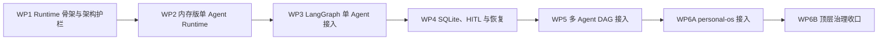

# Personal Agent 独立 Runtime 文件级实施计划

> 状态：已实施 WP1-WP6 并提交；继续保留 legacy 回退
>
> 日期：2026-08-13
>
> 前置设计：[Personal Agent 独立 Runtime 详细设计](../specs/2026-08-13-personal-agent-runtime-design.md)
>
> 实施范围：`personal-agent`（WP1-WP5）、`personal-os` 与 `personal-system` 治理文档（WP6）

## 1. 目标与实施原则

本计划把已确认的 Runtime 设计拆成 WP1-WP6 六个可独立验收、独立提交和独立回滚的工作包。目标不是把 `personal-agent` 改造成 Pi，而是借鉴 Pi 的内核分层：将单 Agent 的模型/工具循环、事件、重试、取消、审批和恢复收敛到独立 Runtime，同时继续由 LangGraph 负责 Commander、多 Agent DAG、replan、aggregate 和 reflection。

实施必须遵守以下原则：

1. 先在独立 `personal-agent` 内完成 Runtime，再调整 `personal-os` 的启动和治理边界。
2. `runtime.domain`、`runtime.ports`、`runtime.core` 严格单向依赖，不得导入 LangGraph、FastAPI、ChatService、Commander、AgentRegistry、具体 Domain Agent 或 `personal-os`。
3. 每个 WP 都保留可用回退点；数据库迁移只向前增加，代码回滚不删除新表。
4. `MATRIX_RUNTIME_MODE` 在 WP1-WP5 始终默认 `legacy`，只有显式配置才进入 `shadow` 或 `runtime`。
5. 标准 function-calling 路径先迁移；Codex direct、Deep Research 在本轮保持原应用路径。
6. 现有 `messages`、旧 ReAct 节点、LangGraph checkpoint、`personal-os/apps/agent` 在本计划内均不删除。
7. Runtime 使用不透明 `owner_id` 做隔离；认证、JWT 和当前登录用户解析仍由 HTTP/Application 层负责。
8. 同一 session 只允许一个活动 operation；不同 session 和 DAG step 可以并行。本轮不建设多进程共享数据库或多用户同时在线能力。
9. Runtime 状态只进入忽略的 SQLite/`var/`/临时目录，不写入 `personal-assets`，不提交 Git。
10. 本计划中的 Runtime、架构、Store 契约和集成测试属于已确认设计的一部分，视为本次明确授权的测试范围。

## 2. 开工前检查点

实际修改代码前必须完成以下检查；任一项不满足都不开始对应仓库的实现：

- 分别确认 `personal-agent`、`personal-os` 的目标分支和允许编辑当前分支。
- 记录三个仓库的 `git status --short` 和当前 HEAD，不覆盖已有未提交变更。
- 特别保留顶层仓当前已存在的 `personal-agent` gitlink/pointer 变化；除非单独确认，不在治理文档提交中暂存它。
- 在 `personal-agent` 记录 legacy 基线：全量 pytest、确定性 regression、关键 SSE/会话测试。
- 在 `personal-os` 记录 Go API 测试和 Agent smoke 基线。
- 所有数据库测试使用 `tmp_path` 或临时目录，禁止指向日常 `var/agent/*.db`。

建议基线命令：

```bash
cd /Users/qiang.lilq/personal-system/personal-agent
python -m pytest
python -m matrix.evaluation.cli regression

cd /Users/qiang.lilq/personal-system/personal-os
env -u GOROOT /opt/homebrew/bin/go test ./...
```

`tools/smoke/agent-chat.sh` 需要真实服务和模型，只在本地凭据可用时执行；Provider 暂时不可用应单独记录为外部依赖问题，不能用来掩盖确定性测试失败。

## 3. 总体顺序与依赖



不能并行实施 WP1-WP5，因为后续包依赖前一包稳定的 Runtime contract。WP6 的文档草案可以提前准备，但代码切换必须等待 WP5 验收。

## 4. WP1：Runtime 骨架与架构护栏

### 4.1 目标

建立纯 Python Runtime 的 domain、ports、core、adapters、testing 包，冻结第一版公共数据结构和依赖方向；不接入 ChatService、LangGraph 或真实模型/工具。

### 4.2 新增文件

在 `/Users/qiang.lilq/personal-system/personal-agent` 新增：

```text
src/matrix/runtime/
  __init__.py
  domain/
    __init__.py
    requests.py
    results.py
    events.py
    messages.py
    operations.py
    approvals.py
    tools.py
    errors.py
  ports/
    __init__.py
    model.py
    tools.py
    store.py
    context.py
    clock.py
    ids.py
  core/
    __init__.py
    runtime.py
    reducer.py
  adapters/
    __init__.py
  testing/
    __init__.py
    fake_model.py
    fake_tools.py
    memory_store.py

tests/runtime/
  test_architecture.py
  test_domain.py
  test_store_contract.py
```

文件职责：

- `domain/requests.py`：`RunRequest`、`ExecutionOptions`、`ResumeInput`，包含不透明 `owner_id`、`session_id`、可选 `orchestration_run_id` 和最终解析后的 prompt/model/tools。
- `domain/results.py`：`RunResult`、`RunOutcome`、usage/error/suspension 结构。
- `domain/events.py`：`RuntimeEvent` 信封、事件类型、operation 内 sequence 约束。
- `domain/messages.py`：与 Provider 无关的 Runtime message/content/tool-call 表达。
- `domain/operations.py`：operation phase、完整快照、schema version、version/CAS 字段。
- `domain/approvals.py`：审批请求、状态、决策及 owner/operation 关联。
- `domain/tools.py`：Runtime 工具声明、调用、结果、`replayable/idempotent/manual` 恢复策略。
- `domain/errors.py`：配置错误、状态冲突、预算耗尽、取消、恢复和 Store 错误分类。
- `ports/model.py`：模型请求/响应/流式事件 Port。
- `ports/tools.py`：工具执行 Port；Runtime 不接触 `ToolRegistry`。
- `ports/store.py`：创建、读取、CAS transition、活动 operation 检查、恢复扫描的 Port。
- `ports/context.py`：上下文预算和 compaction Port；Core 不导入 `matrix.context`。
- `ports/clock.py`、`ports/ids.py`：确定性时间和 ID 生成 Port。
- `core/runtime.py`：`AgentRuntime`、`RunHandle` 的接口骨架；未实现路径明确抛出 Runtime 自有错误。
- `core/reducer.py`：纯函数 transition 校验、phase 合法性和 event sequence 分配。
- `testing/*`：只依赖 Runtime domain/ports 的确定性 Fake 和内存 Store。

### 4.3 修改文件

- `src/matrix/runtime/__init__.py` 只导出稳定公共接口，不能从上层模块重导出类型。
- `pyproject.toml` 不新增生产依赖；如需测试配置，只增加 `tests/runtime` 可被现有 pytest 自动发现所必需的最小配置。
- `README.md` 增加一段 Runtime 分层说明和 `MATRIX_RUNTIME_MODE` 尚未接线的提示，避免用户误以为已切流。

### 4.4 架构护栏

`tests/runtime/test_architecture.py` 使用标准库 `ast` 扫描以下目录：

```text
src/matrix/runtime/domain
src/matrix/runtime/ports
src/matrix/runtime/core
```

禁止 import：

```text
matrix.chat
matrix.server
matrix.orchestration
matrix.agent
langgraph
fastapi
```

同时断言依赖层级：

- domain 不依赖 runtime 其他层和 Matrix 业务模块；
- ports 只能依赖 domain；
- core 只能依赖 domain 和 ports；
- adapters/testing 可以依赖 Core 以下类型，但不能被 Core 反向导入。

### 4.5 实施顺序

1. 先建立 domain 枚举和不可变数据结构。
2. 再定义 ports，确保所有输入输出都来自 domain。
3. 实现纯 reducer 和空 Runtime facade。
4. 实现 Fake/Memory Store。
5. 最后添加架构测试和公共 import 测试。

### 4.6 验证命令

```bash
cd /Users/qiang.lilq/personal-system/personal-agent
python -m pytest tests/runtime/test_architecture.py tests/runtime/test_domain.py tests/runtime/test_store_contract.py
python -c 'from matrix.runtime import AgentRuntime, RunRequest, RunResult, RuntimeEvent'
python -m pytest
git diff --check
```

### 4.7 验收与回滚

验收：Runtime Core 可独立 import；Memory Store 通过最小 contract；AST 护栏能用故意违规 fixture 证明会失败；生产调用链和数据库没有变化。

回滚：直接回滚 WP1 代码提交即可，没有 schema、配置和流量变化。

## 5. WP2：内存版单 Agent Runtime

### 5.1 目标

在 Fake Model、Fake Tool 和 Memory Store 上完成单 Agent function-calling/ReAct 循环，覆盖事件、重试、取消、预算、顺序工具执行和安全终止，不接线上 ChatService。

### 5.2 新增文件

```text
src/matrix/runtime/core/
  loop.py
  retry.py
  recovery.py

src/matrix/runtime/adapters/
  model.py
  tools.py
  context.py

tests/runtime/
  test_runtime_loop.py
  test_runtime_retry.py
  test_runtime_cancel.py
  test_runtime_events.py
  test_runtime_adapters.py
```

### 5.3 修改文件

- `src/matrix/runtime/core/runtime.py`：实现 `start()`、`resume()` 的内存执行路径、`RunHandle.events/result/cancel`。
- `src/matrix/runtime/core/reducer.py`：补齐 `created → preparing → requesting_model → executing_tools → preparing_next_turn → completed/failed/aborted` 转换。
- `src/matrix/runtime/core/loop.py`：实现模型调用、assistant tool call 回填、tool result 回填和下一 turn。
- `src/matrix/runtime/core/retry.py`：按错误分类执行模型 retry；认证/配置错误不重试；context overflow 只触发一次 compaction 后重试。
- `src/matrix/runtime/core/recovery.py`：先实现内存状态的安全恢复分类，不执行启动自动恢复。
- `src/matrix/runtime/adapters/model.py`：将现有 `LLMClient.function_call/stream_complete` 适配为 `ModelPort`；不得改变现有 LLM Client contract。
- `src/matrix/runtime/adapters/tools.py`：将限定后的 `ToolRegistry` 适配为 `ToolExecutorPort`，继续经过参数校验、ToolGuard 和 CircuitBreaker。
- `src/matrix/runtime/adapters/context.py`：包装现有 budget/compaction 能力；Core 只看到 `ContextPort`。
- `src/matrix/tools/base.py`：给 `ToolDefinition` 增加向后兼容且默认安全的恢复元数据；未声明工具默认 `manual`。现有构造调用不要求立即改参数。
- `src/matrix/tools/registry.py`：只增加 Adapter 所需的只读 metadata 查询，不把 Runtime 逻辑塞入 Registry。
- `src/matrix/runtime/testing/*`：支持脚本化多轮模型结果、错误注入、取消点和工具调用计数。

### 5.4 行为约束

- 工具默认顺序执行；即使模型一次返回多个 tool call，也按稳定顺序产生 `tool_start/tool_end`。
- 可预期工具错误生成 `is_error=True` 的 tool result 返回模型，不直接打断 operation。
- `max_turns`、`max_tool_calls`、timeout 和 cancel 都必须产生终态及 `run_end` 或对应失败事件。
- Runtime 不复刻 Commander、早停评估器、领域 sufficiency、reflection；这些仍是上层业务编排能力。
- WP2 的 `recovery.py` 只定义分类规则；持久化恢复在 WP4 实现。
- Fake 脚本必须覆盖无工具回答、单工具、多工具、多轮、自纠错、超限和取消。

### 5.5 验证命令

```bash
cd /Users/qiang.lilq/personal-system/personal-agent
python -m pytest tests/runtime
python -m pytest tests/test_llm_client.py tests/test_tool_registry.py tests/test_tool_guard.py tests/test_circuit_breaker.py
python -m pytest tests/test_orchestration_nodes.py tests/test_orchestration.py
python -m pytest
python -m matrix.evaluation.cli regression
git diff --check
```

### 5.6 验收与回滚

验收：Fake Model 可完整跑通多轮 ReAct；事件 sequence 严格递增；取消和上限能终止；现有 LangGraph 行为不变。

回滚：回滚 WP2 提交；WP1 的接口骨架保留。没有生产流量和 schema 变化。

## 6. WP3：LangGraph 单 Agent 接入与 feature flag

### 6.1 目标

让 LangGraph 的单 step 标准 function-calling 路径可选择调用 Runtime；Commander、aggregate、reflection 和多 Agent DAG 继续保留。默认仍走 legacy。

### 6.2 新增文件

```text
src/matrix/orchestration/runtime_adapter.py
src/matrix/orchestration/nodes/runtime.py
src/matrix/server/runtime_sse.py

tests/runtime/test_langgraph_single_agent.py
tests/runtime/test_runtime_sse.py
tests/runtime/test_runtime_modes.py
```

### 6.3 修改文件

- `src/matrix/config.py`
  - 新增 `MATRIX_RUNTIME_MODE`；只接受 `legacy|shadow|runtime`。
  - 默认值固定为 `legacy`；非法值启动失败，不静默猜测。
  - `AgentConfig` 增加 `runtime_mode`。
- `.env.example`：记录三种模式、默认值和 Codex/Deep Research 例外。
- `src/matrix/orchestration/runtime_adapter.py`
  - 上层解析 `AgentDefinition`、工具白名单、system prompt、history、attachments 和 execution options。
  - 构造 `RunRequest(owner_id=user_id, ...)`。
  - 将 Runtime result 转成 `AgentState` 所需的 `agent_results/tool_results/final_answer`。
- `src/matrix/orchestration/nodes/runtime.py`：实现 `run_agent_node`；只负责调用 Adapter，不在节点内重写 ReAct。
- `src/matrix/orchestration/nodes/__init__.py`：向 graph builder 导出新节点，保留全部 legacy 导出。
- `src/matrix/orchestration/graph.py`
  - `build_graph()` 增加显式 execution profile，分别编译 legacy graph 和 runtime-single graph。
  - runtime-single graph 的单 step 路径为 `commander_plan → run_agent → aggregate → reflection`。
  - 多 step DAG 在 WP3 仍走现有 `delegate`。
  - 不删除 `react_prepare/react_llm/react_tool/react_evaluate`。
- `src/matrix/orchestration/state.py`
  - 增加 `owner_id`、`orchestration_run_id`、`runtime_operations` 映射字段。
  - reducer 仍支持 DAG 并行合并；不得把完整 Runtime state 放进 LangGraph state。
- `src/matrix/chat/_service.py`
  - 构造并持有 Runtime 及两个 compiled graph。
  - 将 HTTP 层解析后的 `user_id` 作为 `owner_id` 传入 AgentState/RunRequest。
  - 模式选择顺序必须先识别 Codex direct 和 Deep Research，再决定 legacy/runtime graph。
  - `legacy` 使用原 graph；`runtime` 仅对 eligible 标准 function-calling 单 Agent 路径启用新 graph。
  - 保留 `_stream_graph_events`、旧 checkpoint 清理和旧 ReAct 代码。
- `src/matrix/server/runtime_sse.py`：唯一负责 Runtime Event 到现有事件名的映射。
- `src/matrix/orchestration/events.py`：只增加调用统一映射所需的 typed helper，不能把 SSE 类型引入 Runtime Core。
- `src/matrix/server/routes/health.py`：健康响应可增加向后兼容字段 `runtime_mode`；不得删除既有字段。
- `tests/test_config.py`、`tests/test_chat.py`、`tests/test_orchestration.py`、`tests/test_orchestration_nodes.py`、`tests/test_server.py`：补充模式、路由和兼容断言。

### 6.4 模式语义

```text
legacy  现有 LangGraph ReAct 产生结果，Runtime 不参与生产执行。
shadow  现有路径产生结果；仅进行 request mapping、eligibility 和 fixture/replay contract 校验。
runtime eligible 单 Agent 标准 function-calling 路径由 Runtime 产生结果。
```

`shadow` 不得再调用一次真实模型或真实工具。没有注入 Fake/Fixture transcript 时，只记录结构化 shadow 诊断，不伪装成结果对比；确定性测试/评测注入 transcript 后才比较 event/result contract。

### 6.5 Codex direct 和 Deep Research

- Provider 为 `codex` 时，无论 `MATRIX_RUNTIME_MODE` 为何，继续调用 `_stream_codex_direct()`。
- `mode=deep_research` 且走现有 Codex research 流时，继续调用 `_stream_deep_research()`。
- 两条路径都不得套进 `run_agent_node`，避免双重 Agent/tool loop。
- health/trace 记录实际 execution path，例如 `codex_direct`、`deep_research_legacy`、`runtime`，便于确认没有误切流。
- `ExternalAgentAdapter` 和 Deep Research 工作流重构不在 WP3-WP6 实现，只记录后续项。

### 6.6 验证命令

```bash
cd /Users/qiang.lilq/personal-system/personal-agent
MATRIX_RUNTIME_MODE=legacy python -m pytest tests/runtime/test_runtime_modes.py tests/runtime/test_langgraph_single_agent.py tests/runtime/test_runtime_sse.py
MATRIX_RUNTIME_MODE=runtime python -m pytest tests/runtime/test_langgraph_single_agent.py tests/test_chat.py tests/test_server.py
python -m pytest tests/test_orchestration.py tests/test_orchestration_nodes.py tests/test_e2e_p0_changes.py
python -m pytest
python -m matrix.evaluation.cli regression
git diff --check
```

如果本地 Codex 可用，额外做一次 direct smoke，确认日志中没有 `run_agent_node`；该检查不能依赖真实工具写入。

### 6.7 验收与回滚

验收：`legacy` 与改造前一致；`runtime` 单 Agent 路径通过；多 Agent 仍 legacy；Codex direct/Deep Research 无双循环；SSE 核心事件兼容。

回滚：运行时立即设置 `MATRIX_RUNTIME_MODE=legacy` 并重启服务。代码层可回滚 WP3，WP1-WP2 保留且不影响生产。

## 7. WP4：SQLite 持久化、Session Entry、HITL 与恢复

### 7.1 目标

将 Runtime operation、event、approval、tool effect 和新 session entry 持久化到 SQLite，建立事务/CAS、owner 隔离、单 session 单活动 operation、启动恢复分类和跨重启 HITL。

### 7.2 新增文件

```text
src/matrix/runtime/adapters/sqlite_schema.py
src/matrix/runtime/adapters/sqlite_store.py
src/matrix/runtime/adapters/legacy_session.py

tests/runtime/test_sqlite_store_contract.py
tests/runtime/test_sqlite_migration.py
tests/runtime/test_runtime_hitl.py
tests/runtime/test_runtime_recovery.py
tests/runtime/test_session_entry_dual_write.py
```

### 7.3 修改文件

- `src/matrix/runtime/core/runtime.py`、`loop.py`、`recovery.py`：所有权威 transition 改为通过 `OperationStorePort.commit()`；实现 suspend/resume 和恢复分类。
- `src/matrix/runtime/adapters/sqlite_schema.py`：集中定义 Runtime schema version 和幂等 migration，不散落在 HTTP/ChatService。
- `src/matrix/runtime/adapters/sqlite_store.py`：实现与 Memory Store 相同的 contract，事务中完成 operation/event/session entry/approval/effect 更新。
- `src/matrix/runtime/adapters/legacy_session.py`：封装迁移期新旧会话双写策略，不让 Core 依赖 `matrix.store`。
- `src/matrix/store.py`
  - 执行 session entry 相关向前迁移。
  - legacy `save_message()` 在 legacy 模式镜像到 `session_entries`。
  - 提供明确开关避免 Runtime 已写 entry 后 `_remember()` 再重复写 entry。
  - 现有 `messages` 继续服务会话列表、history、branch 和 UI。
- `src/matrix/chat/_service.py`
  - Runtime 模式下 operation 创建即持久化 user entry，completed 时持久化 assistant entry。
  - `_remember()` 继续写 legacy `messages` 和触发 Memory Evolution，但不重复写 Runtime 已提交的 entry。
  - `_pending_confirms` 只服务 legacy；Runtime 审批从 SQLite 加载。
  - `resume_chat()` 按实际 execution path 分发到 legacy LangGraph resume 或 Runtime resume。
- `src/matrix/server/app.py`：启动时初始化 SQLite Runtime Store 并扫描未完成 operation；关闭时释放连接。
- `src/matrix/server/routes/chat.py`
  - confirm body 向后兼容现有 `session_id/decision`。
  - 可选接受 `operation_id/approval_id/expected_version`；未提供时只能在当前 owner/session 唯一 pending approval 下解析。
  - 其他 owner、重复审批、过期审批返回明确 404/409/410。
- `src/matrix/server/runtime_sse.py`：映射 `approval_required/run_suspended/run_resumed/recovery_required`，保留现有 `confirm_required` 兼容事件名。
- `src/matrix/server/routes/sessions.py`：仍从 legacy messages 返回 UI contract；可附加 pending operation 摘要但不能改变旧字段语义。
- `tests/test_store.py`、`tests/test_chat.py`、`tests/test_server.py`、`tests/test_auth.py`：补充 owner、HITL、双写和重启测试。

### 7.4 数据库迁移顺序

Runtime 使用现有 `MATRIX_STORE_PATH` 对应的会话 SQLite；LangGraph checkpoint 继续使用 `MATRIX_CHECKPOINT_PATH`，两者不合并。

迁移按以下顺序在一个幂等 schema 初始化事务中执行：

1. 创建 `runtime_schema_meta(version, applied_at)`，记录 Runtime schema 版本。
2. 创建 `session_entries`：
   - `entry_id`、`owner_id`、`session_id`、`parent_entry_id`、`entry_type`、`payload_json`、`created_at`；
   - `entry_id` 主键；
   - `(owner_id, session_id, created_at)` 索引；
   - `parent_entry_id` 索引。
3. 给 `sessions` 增加可空 `entry_leaf_id`，不复用现有指向 `messages.message_id` 的 `leaf_id`。
4. 创建 `orchestration_runs`：`run_id`、`owner_id`、`session_id`、`graph_thread_id`、`status`、时间戳和 metadata。
5. 创建 `runtime_operations`：设计字段外增加 `state_schema_version`、`operation_scope=top_level|dag_step` 和可空 `step_id`；主键 `operation_id`，owner/session/run 索引。WP4 只创建 `top_level` operation，但首次 schema 就为 WP5 预留 DAG 语义。
6. 创建活动 operation 的 partial unique index，只约束同一 `(owner_id, session_id)` 在 active phase 只能有一条 `top_level` operation；同时建立 `(orchestration_run_id, step_id)` 条件唯一索引，防止未来同一 DAG step 重复启动。
7. 创建 `runtime_events`，唯一约束 `(operation_id, sequence)`，并索引 `(owner_id, session_id, created_at)`。
8. 创建 `runtime_approvals`，索引 `(owner_id, status, created_at)` 和 `(operation_id, status)`。
9. 创建 `runtime_tool_effects`，唯一约束 `(operation_id, tool_call_id)`，索引 recovery status。
10. 写入 schema version；执行 `PRAGMA foreign_key_check`，测试环境额外执行 `PRAGMA integrity_check`。

首次迁移不批量回填历史 `messages` 到 `session_entries`，避免在运行时启动阶段做大事务。只从迁移完成后的新消息开始双写；历史回填如有需要另做离线工具。

### 7.5 原子 transition

一次 `SQLiteRuntimeStore.commit()` 必须在同一事务内：

```text
校验 owner + expected operation version
→ 更新 operation snapshot/version/phase
→ 插入连续 Runtime events
→ 插入 session_entries 并更新 sessions.entry_leaf_id
→ 更新 approval/tool effect
→ commit
```

模型、工具、网络、trace callback 和 SSE 输出都在事务外执行。只有 commit 成功的事件才能向上游/SSE 暴露。

### 7.6 Effect Sandwich 与恢复

- 调工具前提交 `intent` 和稳定 `tool_call_id`。
- 调用期间状态为 `executing`；完成后第二个事务写 `settled/failed` 和结果。
- `replayable` 未结算 intent 可显式恢复；`idempotent` 必须复用原 idempotency key；`manual` 一律进入 `recovery_required`。
- 启动扫描只分类为 `resumable/recovery_required/failed`，不在后台自动重放副作用。
- 崩溃在模型请求中时可重试，但 partial assistant content 标记 incomplete，不作为最终 answer。

### 7.7 验证命令

```bash
cd /Users/qiang.lilq/personal-system/personal-agent
python -m pytest tests/runtime/test_store_contract.py tests/runtime/test_sqlite_store_contract.py tests/runtime/test_sqlite_migration.py
python -m pytest tests/runtime/test_runtime_hitl.py tests/runtime/test_runtime_recovery.py tests/runtime/test_session_entry_dual_write.py
python -m pytest tests/test_store.py tests/test_chat.py tests/test_server.py tests/test_auth.py tests/test_e2e_p0_changes.py
MATRIX_RUNTIME_MODE=legacy python -m pytest
MATRIX_RUNTIME_MODE=runtime python -m pytest tests/runtime tests/test_chat.py tests/test_server.py tests/test_orchestration.py
python -m matrix.evaluation.cli regression
git diff --check
```

重启验收使用临时数据库启动两次服务：第一次停在 `waiting_approval`，第二次由同 owner 恢复；随后验证另一 owner、重复 decision 和过期 approval 均不能消费。

### 7.8 验收与回滚

验收：Store contract 在 Memory/SQLite 两个实现上通过；审批可跨重启；owner 隔离和 CAS 生效；Runtime 事件先持久化后输出；legacy history/UI 不变。

回滚：先设置 `MATRIX_RUNTIME_MODE=legacy` 并重启。新表、新列保留，不执行 down migration；旧 `messages` 和 legacy checkpoint 仍可直接工作。必要时回滚 WP4 代码，但不得删除 SQLite 新表。

## 8. WP5：多 Agent DAG 接入 Runtime

### 8.1 目标

让多 Agent DAG 的每个 Domain Agent step 使用独立 Runtime operation，同时保持 LangGraph 的 Send fan-out/fan-in、依赖、replan、aggregate 和 reflection。

### 8.2 新增文件

```text
tests/runtime/test_langgraph_multi_agent.py
tests/runtime/test_langgraph_replan.py
tests/runtime/test_operation_concurrency.py
```

### 8.3 修改文件

- `src/matrix/orchestration/runtime_adapter.py`
  - 新增 DAG step 到 `RunRequest` 的映射。
  - 每个 step 生成独立 `operation_id`，共享 `orchestration_run_id`、owner 和 session。
  - 根据 Domain Agent 构造最小工具白名单和最终 prompt；Runtime 不读取 AgentRegistry。
- `src/matrix/orchestration/nodes/runtime.py`
  - 增加 `runtime_delegate_node`，输出与现有 `delegate_node` 相同的 `agent_results/completed_steps/tool_results` contract。
  - operation 引用写入 state，不把 operation snapshot 复制到 checkpoint。
- `src/matrix/orchestration/graph.py`
  - runtime graph 的多 step 路径改用 `Send("runtime_delegate", ...)`。
  - legacy graph 继续使用 `delegate`。
  - `replan_node`、`aggregate`、`reflection` 和 dependency router 不复制、不下沉到 Runtime。
- `src/matrix/orchestration/state.py`：用可并行 reducer 保存 `{step, agent_id, operation_id, outcome}` 映射，防止 fan-in 丢失。
- `src/matrix/orchestration/nodes/commander.py`
  - 保留 `_run_domain_agent_react`、`delegate_node` 和 `_domain_react_fallback` 作为 legacy 回退。
  - 只抽取可复用的 Domain Agent request preparation helper；不得让 Runtime Core 导入 Commander。
- `src/matrix/chat/_service.py`：为每次 LangGraph 调用创建/恢复 `orchestration_run_id`；完成后更新 run status。
- `src/matrix/runtime/adapters/sqlite_store.py`：允许同 session、同 orchestration run 的并行 step operations，但入口请求仍受单 session 单顶层活动 run 约束。
- `tests/test_orchestration.py`、`tests/test_orchestration_nodes.py`、`tests/test_multi_sample_verify.py`、`tests/test_reflexion.py`：在 runtime profile 下验证现有业务编排语义。

### 8.4 并发约束实现

“同一 session 一个活动 operation”对用户发起的顶层 operation 生效；DAG 内部 operation 通过同一个 `orchestration_run_id` 获得受控例外，只允许计划内不同 step 并发。数据库唯一约束不能简单禁止所有同 session operation，实施时采用：

- `runtime_operations` 增加 `operation_scope=top_level|dag_step` 和稳定 `step_id`；
- partial unique index 只约束活动 `top_level` operation；
- `(orchestration_run_id, step_id)` 唯一，防止同 step 重复启动；
- Runtime Store 在创建 DAG operation 时校验 orchestration run 的 owner/session 与请求一致。

如果 WP4 已建立更严格索引，WP5 只做向前 migration：新增 scope/step 字段，重建为兼容 DAG 的索引；不删除数据表。

### 8.5 验证命令

```bash
cd /Users/qiang.lilq/personal-system/personal-agent
MATRIX_RUNTIME_MODE=runtime python -m pytest tests/runtime/test_langgraph_multi_agent.py tests/runtime/test_langgraph_replan.py tests/runtime/test_operation_concurrency.py
MATRIX_RUNTIME_MODE=runtime python -m pytest tests/test_orchestration.py tests/test_orchestration_nodes.py tests/test_multi_sample_verify.py tests/test_reflexion.py
MATRIX_RUNTIME_MODE=legacy python -m pytest tests/test_orchestration.py tests/test_orchestration_nodes.py
python -m pytest
python -m matrix.evaluation.cli regression
git diff --check
```

有真实 Provider 条件时，再运行单 Agent与多 Agent各一个 smoke，比较工具白名单、最终回答和 operation 映射；不能向真实 `personal-assets` 写入测试数据。

### 8.6 验收与回滚

验收：DAG fan-out/fan-in、depends_on、replan、aggregate、reflection 在 Runtime profile 下通过；每 step 独立 operation；不同 owner/run 不串数据；legacy profile 仍可运行。

回滚：设置 `MATRIX_RUNTIME_MODE=legacy`。保留 WP5 schema 字段和索引；回滚 Runtime DAG 路由代码时，legacy `delegate_node` 立即接管。

## 9. WP6：personal-system 跨仓收口

WP6 分两个按顺序提交的部分：先改 `personal-os` 接入，再改顶层治理。`personal-agent` WP1-WP5 未稳定前不得执行 WP6。

### 9.1 WP6A：personal-os 接入独立 personal-agent

#### 修改文件

- `/Users/qiang.lilq/personal-system/personal-os/tools/dev`
  - 新增 `PERSONAL_OS_AGENT_MODE=managed|external|legacy`，默认 `managed`。
  - `managed`：从 `PERSONAL_AGENT_ROOT`（默认相邻 `../personal-agent`）启动 `python -m matrix`。
  - `external`：不启动 Agent，只等待 `PERSONAL_OS_AGENT_URL/healthz`，退出时不终止外部进程。
  - `legacy`：显式启动 `personal-os/apps/agent`，仅作为短期故障回退；不再是默认值。
  - 支持 `PERSONAL_AGENT_PYTHON`，默认优先相邻仓 `.venv/bin/python`，否则使用现有 `PYTHON_BIN`。
  - managed 启动从 personal-agent 仓加载其 `.env`；进程级显式变量优先。若只配置了 `PERSONAL_OS_AGENT_JWT_SECRET`，启动脚本将它映射为 personal-agent 的 `JWT_SECRET`；两个值同时存在但不一致时快速失败。
  - 继续把 `PERSONAL_OS_CACHE_PATH` 传给独立 Agent，确保 finance 工具与 personal-os API 读取同一份可重建 cache；Runtime Store 仍使用 personal-agent 自己的 `MATRIX_STORE_PATH`。
  - managed 模式缺少相邻仓、解释器或 health 时快速失败并显示明确日志。
- `internal/config/config.go`
  - 保持 `PERSONAL_OS_AGENT_URL` 为唯一 API 代理目标。
  - 不在 Go API 内嵌 Runtime 或读取 Runtime SQLite。
  - 如需暴露诊断，只增加不影响现有配置的 Agent URL 校验。
- `apps/api/agent.go`
  - 继续透传 status、JSON 和 SSE，不解释 Runtime operation 内部状态。
  - 增加 `/api/agent/chat/confirm` 到独立 Agent `/chat/confirm` 的流式代理。
  - 保持 request context 取消向上游传播；不得在代理层重试有副作用请求。
- `apps/api/main_test.go`：补充 confirm 路由、JWT owner 透传、SSE 不缓冲、客户端取消和 Agent unavailable contract。
- `tools/smoke/agent-chat.sh`
  - 继续通过 Go API 而不是直连 Agent。
  - 验证 `tool_call/tool_result/token/done`；允许额外 Runtime 事件但核心事件不可缺失。
  - 不打印个人资产明细。
- `README.md`：开发启动改为独立 Agent，说明 managed/external/legacy 和环境变量。
- `docs/api.md`：明确 `/api/agent/*` 由独立 personal-agent 提供；补 confirm 代理 contract。
- `docs/migration-boundary.md`：把独立 `personal-agent` 改为长期项目，把 `apps/agent` 标记为待退役兼容实现。
- `apps/agent/README.md`：增加 deprecated/legacy-only 标记和回退启动方法。

#### 明确不修改

- `apps/agent/personal_agent/*`：WP6 只停止默认启动，不删除或重构源码。
- `apps/web/src/api/agent.ts`、`apps/web/src/components/AgentPanel.vue`：核心 SSE contract 未变化，本轮不为 Runtime 增加 UI 依赖。
- `apps/mac/Sources/*`：macOS 继续消费现有 SSE；本轮不要求 UI 展示 operation 内部状态。
- `personal-assets`、`personal-tools`：不修改。

#### 验证命令

```bash
cd /Users/qiang.lilq/personal-system/personal-os
env -u GOROOT /opt/homebrew/bin/go test ./...

# 终端 A：独立启动 personal-agent，显式选择当前稳定模式
cd /Users/qiang.lilq/personal-system/personal-agent
MATRIX_RUNTIME_MODE=runtime python -m matrix

# 终端 B：external 模式启动 personal-os
cd /Users/qiang.lilq/personal-system/personal-os
PERSONAL_OS_AGENT_MODE=external tools/dev
bash tools/smoke/agent-chat.sh
```

随后分别验证：

```bash
PERSONAL_OS_AGENT_MODE=managed tools/dev
PERSONAL_OS_AGENT_MODE=legacy tools/dev
```

managed 是目标默认；external 是部署/独立调试模式；legacy 只验证回退仍可启动。

#### 验收与回滚

验收：`personal-os` 默认启动独立 Agent；external 不接管外部进程；Go API/SSE/JWT 兼容；Agent smoke 通过；旧 Agent 仅显式 legacy 启动。

回滚：先设置 `PERSONAL_OS_AGENT_MODE=legacy`，或令 `PERSONAL_OS_AGENT_URL` 指向已运行的兼容服务；不删除独立 Agent 数据库。必要时回滚 personal-os WP6A 提交。

### 9.2 WP6B：顶层治理收口

在 `/Users/qiang.lilq/personal-system` 修改：

- `workspace.yaml`
  - 将独立 `personal-agent` 加入长期 `projects`。
  - 移除“personal-agent 已归档并迁入 personal-os/apps/agent”的错误结论。
  - 将 `personal-os` role 更新为产品入口，通过 HTTP/SSE 使用独立 Agent。
- `docs/project-progress.md`
  - 长期项目表增加 `personal-agent`。
  - 迁移来源表不再把当前独立仓当作已归档来源；历史旧路径可单独标注。
- `docs/personal-os-architecture.md`
  - 将 `apps/agent` 责任改为外部 `personal-agent` 服务边界。
  - 保留 `personal-os` 的产品/API 责任，不再宣称其拥有 Agent Runtime 源码。
- `docs/README.md`：加入本实施计划和最终架构文档索引。
- 必要时更新顶层 `README.md`：只修正项目清单和长期边界，不复制详细设计。

验证：

```bash
cd /Users/qiang.lilq/personal-system
git diff --check
rg -n 'personal-agent.*归档|migrated_into: personal-os/apps/agent|不把 `personal-agent` 保留为长期' workspace.yaml docs personal-os/docs/migration-boundary.md
git status --short
```

搜索结果中若保留历史判断，必须明确标记为“旧决策/已废止”，不能继续作为当前架构描述。

回滚：治理文档可独立回滚，但若 WP6A 已上线，不应把文档恢复成与事实相反的旧边界；优先修正文档而不是回退真实服务。

## 10. Feature flag 转换阶段

### 阶段 A：WP1-WP2

- 配置尚未接生产链路。
- 所有线上行为等价于 legacy。

### 阶段 B：WP3

- `MATRIX_RUNTIME_MODE=legacy` 默认。
- CI/本地确定性测试使用 `shadow` 和 `runtime`。
- 少量手工标准单 Agent smoke 可显式使用 `runtime`。

### 阶段 C：WP4-WP5

- 默认仍为 `legacy`。
- 完成 SQLite/HITL/DAG 验收后，在开发环境把 `runtime` 作为日常观察模式。
- 任一 correctness、隔离、恢复或评测回归立即切回 `legacy`。

### 阶段 D：WP6 稳定观察

- `personal-os` 默认连接独立 personal-agent，但 personal-agent 内部 flag 初始仍可保持 `legacy`。
- 独立服务连接稳定后，再将本机 `.env` 显式设置为 `runtime`。
- 观察期至少覆盖：普通问答、工具调用、会话恢复、多 Agent、Provider 切换、服务重启。

### 阶段 E：后续独立决策

- 只有观察期通过并确认删除计划后，才考虑把代码默认值从 `legacy` 改为 `runtime`。
- 默认值变更必须是独立提交，附完整回归结果和回退说明。
- 本 WP1-WP6 计划不执行该默认值变更。

## 11. 跨仓提交顺序

不自动提交；只有用户明确要求 commit 后，按以下顺序执行，每个提交只包含对应仓库和 WP 的变更：

1. 顶层 `personal-system`：本详细设计、实施计划和文档索引，作为实施依据。
2. `personal-agent`：WP1 commit。
3. `personal-agent`：WP2 commit。
4. `personal-agent`：WP3 commit。
5. `personal-agent`：WP4 commit。
6. `personal-agent`：WP5 commit。
7. `personal-os`：WP6A 接入 commit。
8. 顶层 `personal-system`：WP6B 治理收口 commit。

每个 commit 前都重新运行该 WP 的定向测试和 `git diff --check`。不 squash WP1-WP5，以保留回滚边界。

顶层仓当前将 `personal-agent` 表现为 gitlink/pointer；提交顶层文档时使用显式路径暂存，默认不暂存 `personal-agent` pointer。是否长期保留、更新或移除该 gitlink 属于独立 workspace 治理决策，不夹带进 Runtime 改造。

## 12. 全迁移期必须保留的兼容代码

以下内容在 WP1-WP6 中不得删除：

- `src/matrix/orchestration/nodes/react.py` 及其 helper。
- `src/matrix/orchestration/nodes/commander.py` 中的 legacy delegate/ReAct fallback。
- `ChatService._stream_graph_events()`、legacy compiled graph 和 checkpoint resume。
- `ChatService._stream_codex_direct()`、`_stream_deep_research()`。
- SQLite `messages` 表及其 session/history API。
- LangGraph checkpoint SQLite 和 `MATRIX_CHECKPOINT_PATH`。
- 现有 SSE 事件名与 `/chat`、`/reset`、sessions/provider/tools contract。
- `personal-os/apps/agent` 全部源码和显式 legacy 启动能力。
- personal-os Go API 代理边界。

删除上述内容必须进入“后续清理工作包”，单独设计、确认、提交和回滚演练。

## 13. 后续清理项，不在本轮实施

- 默认值从 `legacy` 改成 `runtime`。
- 删除旧 ReAct 节点和 legacy compiled graph。
- 停止 `messages` 双写或切换会话读取到 `session_entries`。
- 历史 messages 离线回填。
- 删除 `personal-os/apps/agent`。
- 实现 Codex `ExternalAgentAdapter`，只映射生命周期和事件，不接管 Codex 内部工具循环。
- 将 Deep Research 预取/汇总表达为正式 Orchestration workflow。
- JSONL session import/export。
- SSE `id`/`Last-Event-ID` 断线续传。
- 多进程共享 SQLite、分布式锁、队列或多用户并发平台化。

## 14. 最终完成标准

WP1-WP6 完成必须同时满足：

1. Runtime Core 的架构护栏持续通过，没有下层反向依赖。
2. 标准单 Agent和多 Agent Domain step 都可由 Runtime 执行。
3. Commander、DAG、replan、aggregate、reflection 仍由 LangGraph 承担。
4. Runtime SQLite、HITL、CAS、owner 隔离、恢复分类通过确定性测试和重启验证。
5. Codex direct 和 Deep Research 仍是清晰的 legacy/application 例外，没有双重 Agent loop。
6. `MATRIX_RUNTIME_MODE=legacy` 可立即回退，且不要求回滚 schema。
7. personal-os 默认连接独立 personal-agent，managed/external/legacy 三种开发模式行为明确。
8. personal-os Go API、JWT 和核心 SSE contract 无回归。
9. `personal-assets` 与 `personal-tools` 未被侵入，运行态未进入 Git。
10. 顶层治理文档与真实长期项目边界一致。

完成本计划评审后，下一步从 WP1 开始；进入代码修改前，再按仓库确认 `personal-agent` 的目标分支和是否编辑当前分支。
